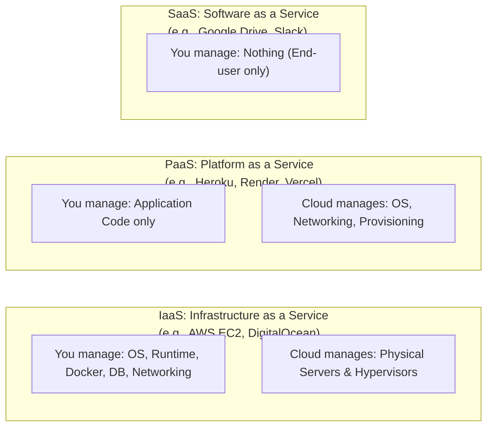
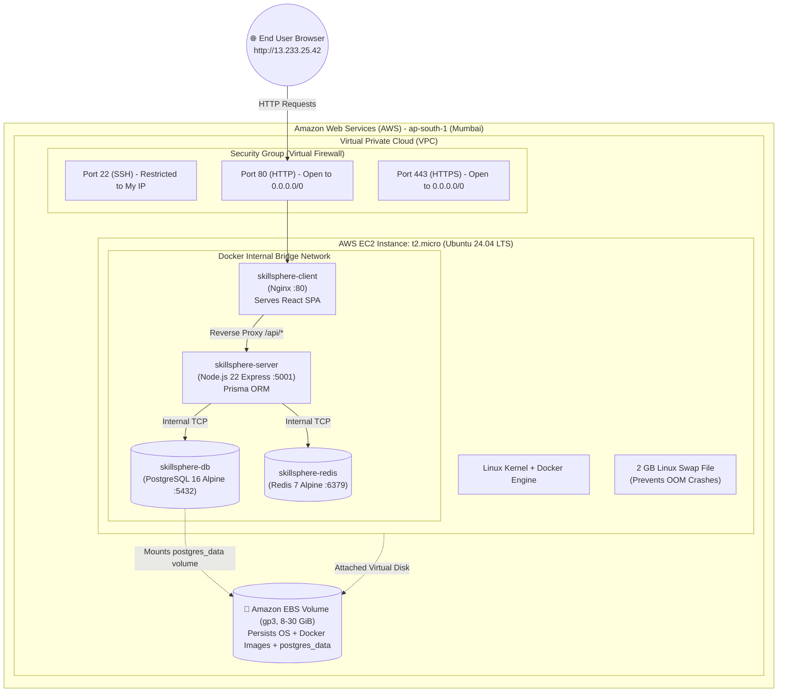
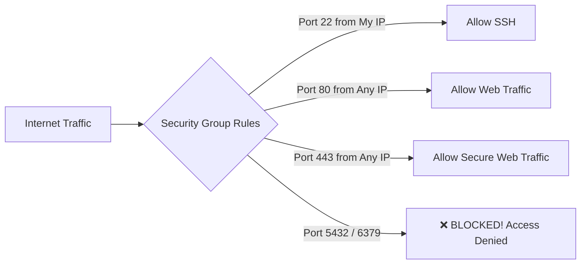
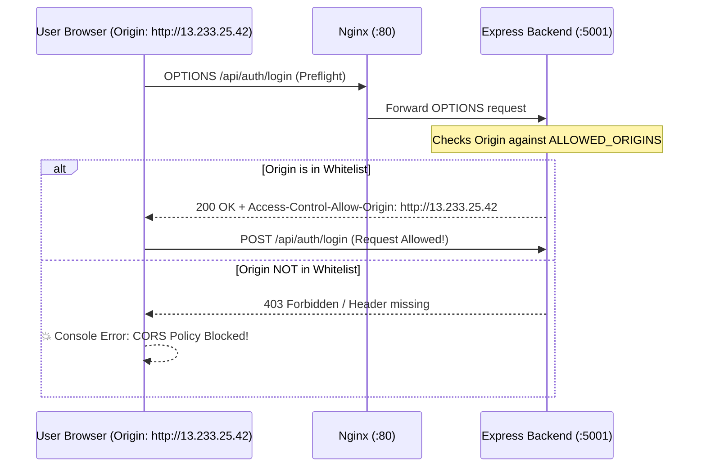
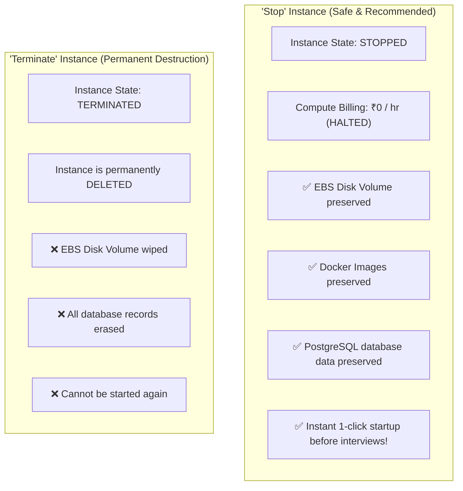
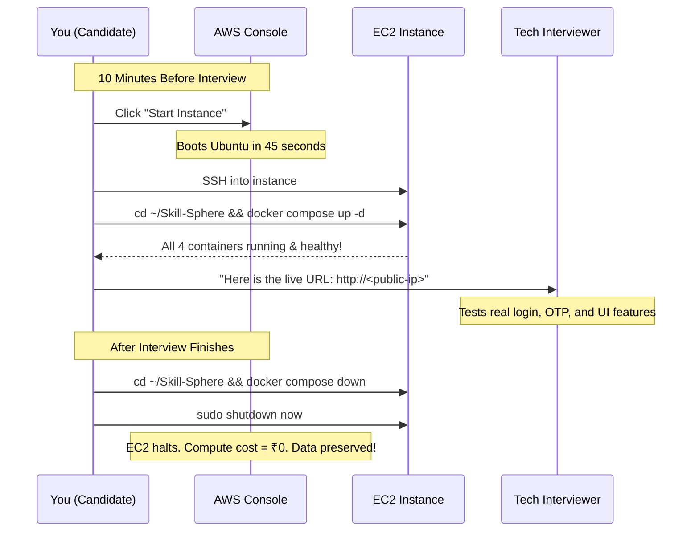

# ☁️ Master Guide: Cloud Deployment on AWS EC2
### *From Ground Zero to a Production-Ready, Zero-Cost Cloud Architecture (The SkillSphere Blueprint)*

---

## 📌 Table of Contents
1. [Introduction: Cloud Computing from First Principles](#1-introduction-cloud-computing-from-first-principles)
   - [What is the Cloud?](#what-is-the-cloud)
   - [IaaS vs PaaS vs SaaS](#iaas-vs-paas-vs-saas)
   - [Why Deploying on AWS EC2 Sets You Apart in Interviews](#why-deploying-on-aws-ec2-sets-you-apart-in-interviews)
2. [AWS Cloud Infrastructure Architecture](#2-aws-cloud-infrastructure-architecture)
   - [SkillSphere Production Cloud Diagram](#skillsphere-production-cloud-diagram)
   - [EC2 Instances (`t2.micro` / `t3.micro`)](#ec2-instances-t2micro--t3micro)
   - [EBS (Elastic Block Store): Persistent Disks Explained](#ebs-elastic-block-store-persistent-disks-explained)
   - [VPC, Subnets, and Internet Gateways](#vpc-subnets-and-internet-gateways)
3. [AWS Security Groups (The Virtual Firewall)](#3-aws-security-groups-the-virtual-firewall)
   - [What is a Security Group?](#what-is-a-security-group)
   - [Configuring Inbound & Outbound Rules](#configuring-inbound--outbound-rules)
   - [The Golden Security Rule for Databases & Redis](#the-golden-security-rule-for-databases--redis)
4. [Step-by-Step Server Setup from Scratch](#4-step-by-step-server-setup-from-scratch)
   - [Provisioning the Ubuntu EC2 Instance](#provisioning-the-ubuntu-ec2-instance)
   - [SSH Keys & File Permissions (`.pem` security)](#ssh-keys--file-permissions-pem-security)
   - [Connecting to Your Server via SSH](#connecting-to-your-server-via-ssh)
   - [Installing Docker Engine & Docker Compose on Ubuntu](#installing-docker-engine--docker-compose-on-ubuntu)
   - [The Life-Saving Trick: Adding 2GB SWAP Space](#the-life-saving-trick-adding-2gb-swap-space)
5. [CORS & Environment Configuration](#5-cors--environment-configuration)
   - [The Production Bug: `CORS: origin not in whitelist`](#the-production-bug-cors-origin-not-in-whitelist)
   - [Understanding Cross-Origin Resource Sharing (CORS)](#understanding-cross-origin-resource-sharing-cors)
   - [Configuring `ALLOWED_ORIGINS` for IP and Domain](#configuring-allowed_origins-for-ip-and-domain)
6. [The Zero-Cost (₹0) Interview Strategy](#6-the-zero-cost-0-interview-strategy)
   - [Stopping vs Terminating: The Crucial Difference](#stopping-vs-terminating-the-crucial-difference)
   - [AWS Free Tier Limits & EBS Storage Billing](#aws-free-tier-limits--ebs-storage-billing)
   - [How to Check Your AWS Storage Costs](#how-to-check-your-aws-storage-costs)
   - [Dynamic IP vs Elastic IP](#dynamic-ip-vs-elastic-ip)
   - [The "Show & Tell" Interview Workflow](#the-show--tell-interview-workflow)
7. [Production Domain & HTTPS (SSL/TLS)](#7-production-domain--https-ssltls)
   - [Connecting a Custom Domain (`skillsphere.xyz`)](#connecting-a-custom-domain-skillspherexyz)
   - [Free SSL with Let's Encrypt & Certbot](#free-ssl-with-lets-encrypt--certbot)
8. [Linux Sysadmin & Operational Monitoring Commands](#8-linux-sysadmin--operational-monitoring-commands)
   - [Process & Resource Monitoring (`docker stats`, `htop`, `free -h`, `df -h`)](#process--resource-monitoring)
   - [Log Inspection (`docker logs`, `journalctl`)](#log-inspection)
   - [Graceful System Shutdown](#graceful-system-shutdown)
9. [Interview Blueprint & Resume Positioning](#9-interview-blueprint--resume-positioning)
   - [What to Write on Your Resume](#what-to-write-on-your-resume)
   - [What You Can Truthfully Defend in Technical Interviews](#what-you-can-truthfully-defend-in-technical-interviews)
   - [What NOT to Claim Yet](#what-not-to-claim-yet)

---

## 1. Introduction: Cloud Computing from First Principles

### What is the Cloud?
"The cloud" is simply someone else's high-availability computer datacenter accessible over the internet. Instead of buying physical server racks, power supplies, cooling fans, and ethernet cables, providers like **Amazon Web Services (AWS)** let you rent virtual hardware on-demand by the second.

### IaaS vs PaaS vs SaaS
To understand where AWS EC2 fits, consider the cloud service model spectrum:



### Why Deploying on AWS EC2 Sets You Apart in Interviews
Many bootcamp graduates and students deploy their projects by connecting their GitHub repo to Render, Vercel, or Heroku (PaaS). While convenient, PaaS platforms hide:
- How Linux operating systems actually work.
- How SSH key pairs authenticate remote terminals.
- How reverse proxies (Nginx) handle routing and SSL termination.
- How firewalls and networking security groups block unauthorized traffic.
- How to diagnose Out-Of-Memory kernel crashes and inspect system logs.

Deploying on **AWS EC2 using Docker Compose** proves to interviewers that you possess real **Systems Engineering & DevOps foundations**.

---

## 2. AWS Cloud Infrastructure Architecture

### SkillSphere Production Cloud Diagram



---

### EC2 Instances (`t2.micro` / `t3.micro`)
An **EC2 (Elastic Compute Cloud)** instance is a virtual machine provisioned on top of AWS's physical hardware.
- Under the AWS Free Tier, users get **750 hours per month** of a `t2.micro` (or `t3.micro` depending on region).
- **Specs**: 1 vCPU (burstable performance), 1 GB of physical RAM.
- **Operating System**: Ubuntu 24.04 LTS (Long Term Support) is the industry standard.

---

### EBS (Elastic Block Store): Persistent Disks Explained
When you launch an EC2 instance, AWS attaches a virtual SSD called an **EBS Volume**.
- Think of the EC2 instance as the computer processor/RAM, and EBS as the hard drive plugged into it with a high-speed virtual cable.
- Under the Free Tier, AWS grants **30 GB of EBS storage** free per month.
- **Why this matters for your database**: When you shut down (`Stop`) your EC2 instance, the virtual CPU stops computing, but **the EBS volume remains safely stored on AWS's disks**. Your Docker images, your Git repository, and your PostgreSQL data files inside `postgres_data` remain 100% intact!

---

### VPC, Subnets, and Internet Gateways
- **VPC (Virtual Private Cloud)**: Your private isolated network slice inside AWS.
- **Subnet**: A subdivision of your VPC within a specific Availability Zone.
- **Internet Gateway (IGW)**: The router connecting your VPC subnet to the public internet, assigning your instance a public IPv4 address (e.g., `13.233.25.42`).

---

## 3. AWS Security Groups (The Virtual Firewall)

### What is a Security Group?
A **Security Group** is a virtual firewall that controls all incoming (**Inbound**) and outgoing (**Outbound**) traffic at the EC2 instance level. By default, AWS blocks **ALL incoming traffic** until you explicitly open specific ports.



---

### Configuring Inbound & Outbound Rules

Configure your EC2 Security Group with these exact rules:

| Type | Protocol | Port Range | Source | Purpose |
| :--- | :--- | :--- | :--- | :--- |
| **SSH** | TCP | `22` | `My IP` (e.g., `103.xxx.xxx.xxx/32`) | Secure terminal access restricted to your computer |
| **HTTP** | TCP | `80` | `0.0.0.0/0` & `::/0` | Public web browser access to your client Nginx |
| **HTTPS** | TCP | `443` | `0.0.0.0/0` & `::/0` | Secure SSL/TLS encrypted traffic |

**Outbound Rules**: Keep default `All traffic` (`0.0.0.0/0`), allowing the server to download packages, pull Docker images, and send email OTPs.

---

### The Golden Security Rule for Databases & Redis
> ⚠️ **NEVER open Port 5432 (PostgreSQL) or Port 6379 (Redis) to `0.0.0.0/0` in your Security Group!**

If you open port 5432 or 6379 to the public internet, automated botnets will find your server within 15 minutes, brute-force your database password, delete all your data, and leave a Bitcoin ransom note.

**How does SkillSphere stay secure?**
In SkillSphere's architecture, ports 5432 and 6379 are only exposed to the private Docker bridge network. The backend `skillsphere-server` container communicates with PostgreSQL over the internal Docker network (`db:5432`), while external internet traffic can only ever reach port 80 (Nginx).

---

## 4. Step-by-Step Server Setup from Scratch

### Provisioning the Ubuntu EC2 Instance
1. Log into AWS Management Console → Search **EC2** → Click **Launch Instance**.
2. **Name**: `skillsphere-production`.
3. **Application and OS Images**: Choose `Ubuntu 24.04 LTS` (64-bit x86).
4. **Instance Type**: Select `t2.micro` (Free Tier eligible).
5. **Key Pair (login)**: Click **Create new key pair** → Name it `skillsphere-key` → Type `RSA` → Format `.pem` → Click **Create key pair**. The `.pem` file will download to your local machine.
6. **Network Settings**:
   - Allow SSH traffic from: `My IP`.
   - Allow HTTP traffic from the internet: Checked.
   - Allow HTTPS traffic from the internet: Checked.
7. **Configure Storage**: Set to `20 GiB` `gp3` (Well within the 30 GiB free tier).
8. Click **Launch Instance**.

---

### SSH Keys & File Permissions (`.pem` security)

SSH keys use asymmetric cryptography. Your `.pem` file contains your **private key**; AWS stores the corresponding **public key** on the EC2 instance inside `~/.ssh/authorized_keys`.

#### ⚠️ Security Warning on Key Permissions:
SSH will refuse to connect if your private key permissions are too loose (readable by other users).

- **On macOS / Linux**:
  ```bash
  chmod 400 skillsphere-key.pem
  ```
- **On Windows (PowerShell)**:
  ```powershell
  icacls skillsphere-key.pem /inheritance:r
  icacls skillsphere-key.pem /grant:r "$($env:USERNAME):(R)"
  ```

---

### Connecting to Your Server via SSH

From your local terminal, navigate to where your `.pem` key is saved:
```bash
ssh -i skillsphere-key.pem ubuntu@<YOUR_EC2_PUBLIC_IP>
```
*Example:* `ssh -i skillsphere-key.pem ubuntu@13.233.25.42`

Type `yes` when prompted to verify the host fingerprint. You are now inside your cloud Linux server!

---

### Installing Docker Engine & Docker Compose on Ubuntu

Run these commands on your fresh EC2 instance:

```bash
# 1. Update existing package lists
sudo apt update && sudo apt upgrade -y

# 2. Install prerequisite packages
sudo apt install -y ca-certificates curl gnupg lsb-release

# 3. Add Docker's official GPG key
sudo install -m 0755 -d /etc/apt/keyrings
curl -fsSL https://download.docker.com/linux/ubuntu/gpg | sudo gpg --dearmor -o /etc/apt/keyrings/docker.gpg
sudo chmod a+r /etc/apt/keyrings/docker.gpg

# 4. Set up the Docker repository
echo \
  "deb [arch=$(dpkg --print-architecture) signed-by=/etc/apt/keyrings/docker.gpg] https://download.docker.com/linux/ubuntu \
  $(lsb_release -cs) stable" | sudo tee /etc/apt/sources.list.d/docker.list > /dev/null

# 5. Install Docker Engine, CLI, and Docker Compose Plugin
sudo apt update
sudo apt install -y docker-ce docker-ce-cli containerd.io docker-buildx-plugin docker-compose-plugin

# 6. Allow the 'ubuntu' user to run Docker commands without typing 'sudo'
sudo usermod -aG docker ubuntu
```

*Log out of SSH and log back in for the group membership to take effect:*
```bash
exit
ssh -i skillsphere-key.pem ubuntu@<YOUR_EC2_PUBLIC_IP>
docker ps  # Should succeed without 'sudo'!
```

---

### The Life-Saving Trick: Adding 2GB SWAP Space
An EC2 `t2.micro` has only **1 GB of RAM**. When running Node.js, PostgreSQL, and Redis simultaneously, memory spikes can cause the Linux kernel to invoke the **OOM Killer**, crashing containers without warning.

**Swap Space** allows the operating system to use a portion of the SSD disk as emergency overflow memory when RAM is full.

Execute these commands to create a 2GB Swap file:
```bash
# Allocate a 2GB swap file
sudo fallocate -l 2G /swapfile

# Set restrictive permissions (root-only access)
sudo chmod 600 /swapfile

# Format the file as Linux swap area
sudo mkswap /swapfile

# Enable the swap space
sudo swapon /swapfile

# Make the swap permanent across reboots
echo '/swapfile none swap sw 0 0' | sudo tee -a /etc/fstab

# Verify swap is active
free -h
```
You will now see:
```
              total        used        free      shared  buff/cache   available
Mem:          957Mi       320Mi       150Mi       1.0Mi       487Mi       510Mi
Swap:         2.0Gi        50Mi       1.95Gi
```
This single configuration guarantees your EC2 server will never crash from low memory spikes!

---

## 5. CORS & Environment Configuration

### The Production Bug: `CORS: origin not in whitelist`
During your deployment debugging session, the server log printed:
```
CORS: origin http://13.233.25.42 not in whitelist
```

### Understanding Cross-Origin Resource Sharing (CORS)
CORS is a browser security mechanism designed to prevent malicious websites from making unauthorized requests to your API.
- If your frontend application is loaded in the browser from `http://13.233.25.42`.
- When your frontend sends an API request (e.g., `fetch('http://13.233.25.42:5001/api/auth/login')`), the browser attaches an HTTP header:
  ```http
  Origin: http://13.233.25.42
  ```
- The backend Express server checks this incoming origin against its allowed whitelist. If `http://13.233.25.42` is not in the whitelist, the browser blocks the response with a CORS violation!



---

### Configuring `ALLOWED_ORIGINS` for IP and Domain
Inside your EC2 server's `server/.env` file:
```env
PORT=5001
NODE_ENV=production

# Include both your EC2 Public IP and your local dev origins (and domain once acquired)
ALLOWED_ORIGINS=http://localhost:5173,http://13.233.25.42,http://skillsphere.xyz,https://skillsphere.xyz

DATABASE_URL=postgresql://postgres:password@db:5432/skillsphere?schema=public
DIRECT_URL=postgresql://postgres:password@db:5432/skillsphere?schema=public
REDIS_URL=redis://redis:6379
```
*Tip*: Because SkillSphere uses Nginx as a reverse proxy, when the client communicates with `/api/`, the request goes to port 80 on the same origin (`http://13.233.25.42`), bypassing cross-origin restrictions entirely! However, keeping `ALLOWED_ORIGINS` updated ensures absolute resilience.

---

## 6. The Zero-Cost (₹0) Interview Strategy

One of the biggest concerns for developers is: *"Will deploying this on AWS drain my bank account?"*
The answer is **NO**, if you follow this disciplined approach.

### Stopping vs Terminating: The Crucial Difference



---

### AWS Free Tier Limits & EBS Storage Billing
- **EC2 Compute**: 750 hours/month of `t2.micro`. If you run 1 instance for the entire 31 days of a month:
  $$24 \text{ hours/day} \times 31 \text{ days} = 744 \text{ hours}$$
  **Result: 100% Free!**
- **EBS Storage**: AWS grants **30 GB-months** of general purpose SSD (gp2/gp3) storage for free.
  - If your volume is configured to **20 GB**, you are using 20/30 GB of your free allowance.
  - Even if you stop the instance, the EBS volume remains reserved. Since 20 GB $\le$ 30 GB, **cost remains ₹0!**

---

### How to Check Your AWS Storage Costs
1. In the AWS Console, search **Billing and Cost Management**.
2. Click **Bills** or **Cost Explorer** in the left sidebar.
3. Review line items:
   - `Amazon Elastic Compute Cloud`
   - `EBS (Elastic Block Store)`
4. To check attached volume size:
   - Go to **EC2** → **Volumes**.
   - Verify that your volume size is between `8 GiB` and `30 GiB` and shows state `In-use`.

---

### Dynamic IP vs Elastic IP

- **Dynamic Public IP (Default)**:
  - AWS assigns a free public IPv4 address to your instance (e.g., `13.233.25.42`).
  - When you **Stop** the instance and **Start** it again, AWS releases the old IP back to the global pool and assigns your instance a **new public IP**!
- **Elastic IP (Static IP)**:
  - An Elastic IP remains fixed forever, even across reboots.
  - **The Cost Trap**: AWS charges a fee (~$0.005/hr) for Elastic IPs if they are allocated to an instance that is **stopped**!
- **The Best ₹0 Strategy for Beginners**:
  - Keep the default dynamic IP!
  - When you start your instance before an interview, copy the newly assigned Public IP from the AWS console, verify it in your browser, and demo the live app.

---

### The "Show & Tell" Interview Workflow



---

## 7. Production Domain & HTTPS (SSL/TLS)

### Connecting a Custom Domain (`skillsphere.xyz`)
Using raw IP addresses like `http://13.233.25.42` works for interviews, but having a custom domain like `https://skillsphere.xyz` looks deeply professional.
1. Purchase an inexpensive domain from Namecheap, Cloudflare, or GoDaddy (~$2–$10/year).
2. Go to your domain's DNS Management settings.
3. Add an **A Record**:
   - **Type**: `A`
   - **Host/Name**: `@` (or `www`)
   - **Value / IP**: Your EC2 Public IPv4 address (`13.233.25.42`)
   - **TTL**: `Automatic` or `300 seconds`

---

### Free SSL with Let's Encrypt & Certbot

**Let's Encrypt** is a non-profit Certificate Authority providing free, automated X.509 certificates for TLS encryption.

Using **Certbot** with Nginx:
```bash
# 1. Install Certbot and the Nginx plugin on EC2
sudo apt install -y certbot python3-certbot-nginx

# 2. Request and install an SSL certificate
sudo certbot --nginx -d skillsphere.xyz -d www.skillsphere.xyz
```
Certbot will:
1. Contact Let's Encrypt servers.
2. Complete an automated HTTP-01 challenge proving you control the domain.
3. Generate private keys and certificates in `/etc/letsencrypt/live/skillsphere.xyz/`.
4. Automatically configure Nginx to listen on Port 443 with modern SSL ciphers and redirect all HTTP traffic to HTTPS!
5. Install a systemd timer that automatically renews the certificate every 90 days for free!

---

## 8. Linux Sysadmin & Operational Monitoring Commands

Interviewers frequently ask: *"How do you know if your production containers are healthy or consuming too much memory?"*
Knowing standard Linux and Docker CLI inspection commands proves operational maturity.

### Process & Resource Monitoring

```bash
# 1. Real-time streaming container CPU, RAM, and Network I/O
docker stats
```
*Output sample:*
```
CONTAINER ID   NAME                 CPU %     MEM USAGE / LIMIT     MEM %
a1b2c3d4e5f6   skillsphere-server   0.45%     85.4MiB / 957MiB      8.92%
f7e8d9c0b1a2   skillsphere-db       0.12%     45.2MiB / 957MiB      4.72%
c3d4e5f6a7b8   skillsphere-client   0.01%     12.1MiB / 957MiB      1.26%
```

```bash
# 2. Interactive system process viewer (CPU cores, memory, load average)
htop

# 3. Check available RAM and active Swap space in human-readable format
free -h

# 4. Check available disk space on the EBS volume
df -h
```

---

### Log Inspection

```bash
# Follow live output of all containers
docker compose logs -f

# Follow live output of the backend server only
docker compose logs -f server

# View the last 50 lines of logs with timestamps
docker compose logs --tail=50 -t db

# View systemd system logs for the Docker service itself
sudo journalctl -u docker.service -n 50 --no-pager
```

---

### Graceful System Shutdown
To leave your infrastructure clean without risking database corruption:
```bash
cd ~/Skill-Sphere
docker compose down
sudo shutdown now
```

---

## 9. Interview Blueprint & Resume Positioning

### What to Write on Your Resume

#### ❌ Weak / Generic:
> *"Deployed fullstack project on AWS."*

#### ✅ Strong, Impactful, and Backed by Real Experience:
> **Full-Stack Application Deployment & DevOps | AWS & Docker**
> - Containerized a full-stack production application (React, Node.js Express, PostgreSQL, Redis) using **Docker**, **Docker Compose**, and **multi-stage builds**, reducing frontend image size by 97%.
> - Architected cloud infrastructure on **AWS EC2 (Ubuntu Linux)** with custom **Security Groups**, internal bridge networking, and persistent **EBS-backed Docker volumes** for zero-loss database state.
> - Configured **Nginx reverse proxy** to manage client-side routing, route WebSocket traffic, and proxy REST APIs over internal Docker DNS.
> - Implemented automated **Prisma database migration workflows** (`prisma migrate deploy`) and established operational monitoring using `docker stats`, `htop`, and systemd logging.

---

### What You Can Truthfully Defend in Technical Interviews

| Topic | What You Can Confidently Explain |
| :--- | :--- |
| **Linux & SSH** | Generating `.pem` key pairs, setting file permissions (`chmod 400`), provisioning Ubuntu instances, configuring swap space to prevent memory crashes. |
| **Docker Mechanics** | How immutable image layering works, cache invalidation order, difference between containers and VMs, running non-root users (`USER node`) for security. |
| **Multi-Stage Builds** | Building static assets in a Node environment and serving them from a 25MB Nginx Alpine image. |
| **Docker Compose** | Orchestrating multi-container systems, defining healthcheck dependencies (`condition: service_healthy`), injecting environment variables. |
| **Networking** | Docker user-defined bridge networks, internal DNS resolution by service name, reverse proxying `/api/` traffic via Nginx. |
| **Data Persistence** | The difference between container ephemeral storage and Docker named volumes; why `docker compose down` preserves data while `docker compose down -v` wipes it. |
| **Database Migrations** | The exact difference between `prisma db push`, `prisma migrate dev`, and `prisma migrate deploy`; diagnosing column mismatch errors (`P2022`). |
| **Cloud Cost Control** | The difference between Stopping and Terminating an EC2 instance; maintaining zero-cost hosting within AWS Free Tier limits. |

---

### What NOT to Claim Yet
Be transparent about what you haven't implemented yet:
- ❌ **Kubernetes (K8s)**: Be honest: *"I orchestrate multi-container setups using Docker Compose on EC2; Kubernetes is what I'm looking forward to learning next."*
- ❌ **Terraform / Infrastructure as Code**: You used the AWS Management Console and Linux CLI.
- ❌ **Multi-Region High Availability / Auto-Scaling Groups**: You are running a single-node production setup.

Interviewers value genuine, deep understanding of real fundamentals over inflated keyword checklists every single time.

---

### 🗺️ Next Steps in Your Mastery Roadmap:
1. Review [Containerization Guide](file:///C:/Users/kshit/cs/skillsphere/containerization.md) for deep Dockerfile and Compose mechanics.
2. Review [CI/CD Pipeline Guide](file:///C:/Users/kshit/cs/skillsphere/pipeline.md) to automate builds and test workflows.
