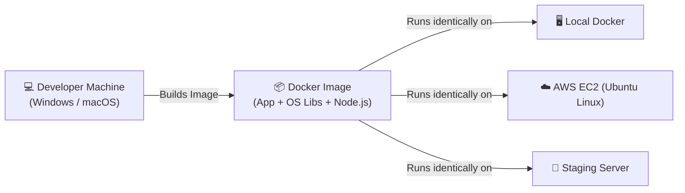
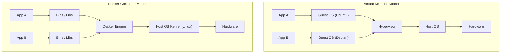
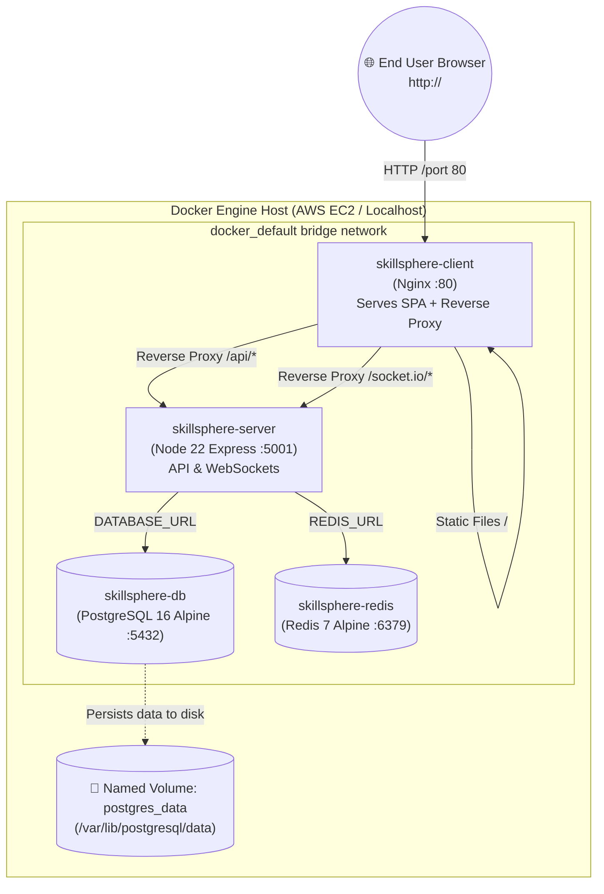
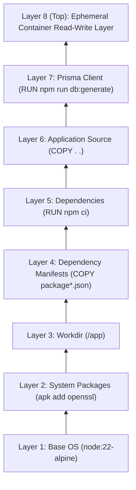
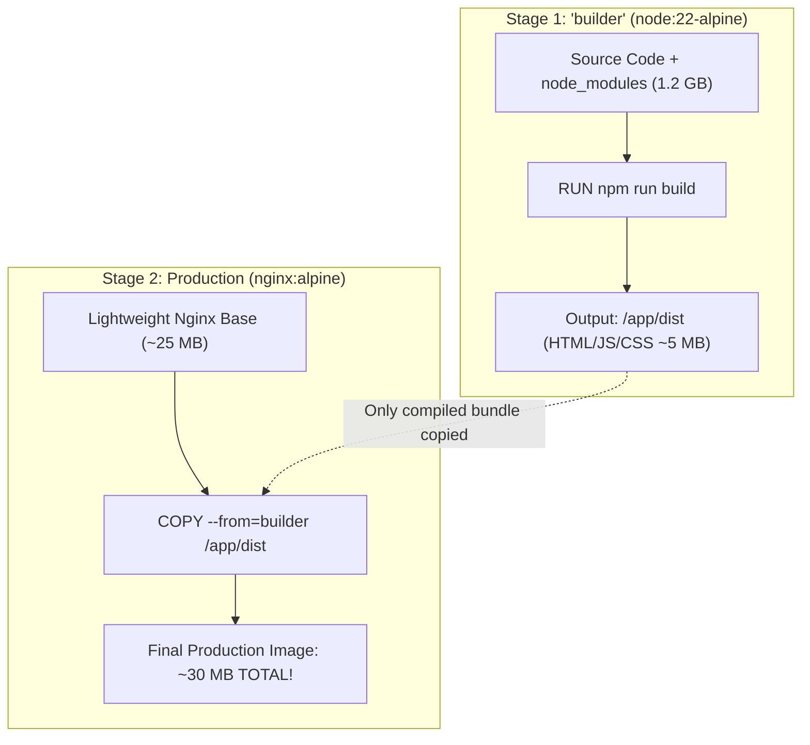
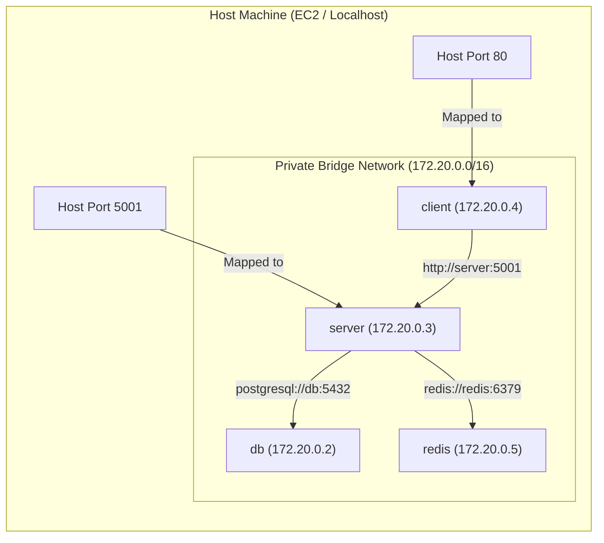
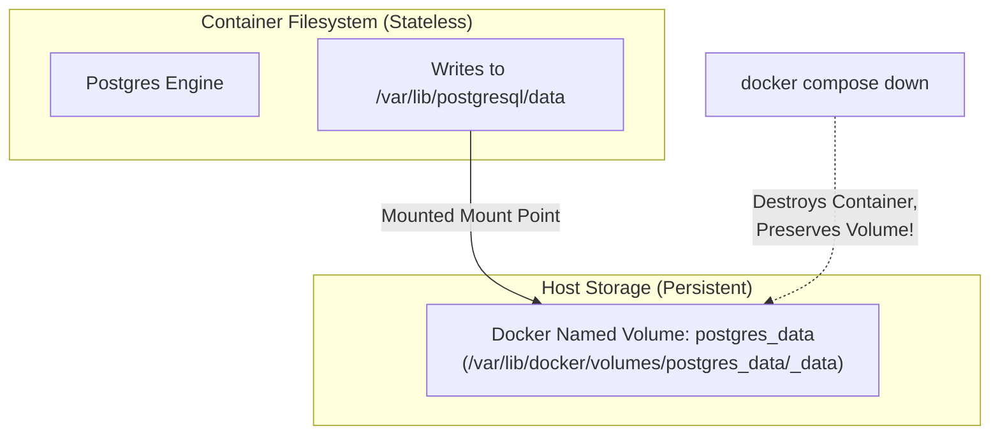

# 🐳 Master Guide: Containerization with Docker & Docker Compose
### *From Ground Zero to Production-Ready Full-Stack Deployment (The SkillSphere Blueprint)*

---

## 📌 Table of Contents
1. [Introduction: What is Containerization?](#1-introduction-what-is-containerization)
   - [The "Works on My Machine" Dilemma](#the-works-on-my-machine-dilemma)
   - [Virtual Machines (VMs) vs Containers](#virtual-machines-vms-vs-containers)
   - [Docker Core Architecture](#docker-core-architecture)
2. [SkillSphere Architecture Overview](#2-skillsphere-architecture-overview)
   - [Multi-Container Architecture Diagram](#multi-container-architecture-diagram)
   - [Role of Each Service](#role-of-each-service)
3. [Deep-Dive: Dockerfile Mechanics & Layer Caching](#3-deep-dive-dockerfile-mechanics--layer-caching)
   - [How Docker Images are Built (Immutable Layers)](#how-docker-images-are-built-immutable-layers)
   - [Cache Invalidation & Order of Execution](#cache-invalidation--order-of-execution)
4. [Backend Containerization: Server Dockerfile Breakdown](#4-backend-containerization-server-dockerfile-breakdown)
   - [Line-by-Line Anatomy](#line-by-line-anatomy)
   - [Why Alpine Linux? (`node:22-alpine`)](#why-alpine-linux-node22-alpine)
   - [The Prisma & OpenSSL Gotcha (`apk add openssl`)](#the-prisma--openssl-gotcha-apk-add-openssl)
   - [Security & File Permissions (`--chown=node:node` & non-root user)](#security--file-permissions---chownnodenode--non-root-user)
   - [Prisma Client Generation Inside the Image](#prisma-client-generation-inside-the-image)
5. [Frontend Containerization: Multi-Stage Builds & Nginx](#5-frontend-containerization-multi-stage-builds--nginx)
   - [What is a Multi-Stage Build & Why is it Critical?](#what-is-a-multi-stage-build--why-is-it-critical)
   - [Stage 1: Node Builder](#stage-1-node-builder)
   - [Stage 2: Nginx Web Server](#stage-2-nginx-web-server)
   - [Vite Environment Variables at Build Time (`ARG` vs `ENV`)](#vite-environment-variables-at-build-time-arg-vs-env)
   - [Reverse Proxy Configuration (`nginx.conf`)](#reverse-proxy-configuration-nginxconf)
6. [Multi-Container Orchestration: `docker-compose.yml`](#6-multi-container-orchestration-docker-composeyml)
   - [Services Breakdown](#services-breakdown)
   - [Healthchecks & Container Startup Ordering (`depends_on`)](#healthchecks--container-startup-ordering-depends_on)
   - [Database Migrations at Startup (`sh -c "npm run db:deploy && npm start"`)](#database-migrations-at-startup)
   - [Environment Variable Injection](#environment-variable-injection)
7. [Docker Networking: How Containers Talk to Each Other](#7-docker-networking-how-containers-talk-to-each-other)
   - [Bridge Networks & Embedded DNS](#bridge-networks--embedded-dns)
   - [Internal Container Ports vs Exposed Host Ports](#internal-container-ports-vs-exposed-host-ports)
8. [Data Persistence: Docker Volumes Explained](#8-data-persistence-docker-volumes-explained)
   - [Ephemeral Storage vs Named Volumes](#ephemeral-storage-vs-named-volumes)
   - [PostgreSQL Data Volume (`postgres_data`)](#postgresql-data-volume-postgres_data)
   - [`docker compose down` vs `docker compose down -v`](#docker-compose-down-vs-docker-compose-down--v)
9. [Operational Cheat Sheet & Debugging Playbook](#9-operational-cheat-sheet--debugging-playbook)
   - [Inspection Commands](#inspection-commands)
   - [Debugging Container Crashes & Logs](#debugging-container-crashes--logs)
   - [Graceful Shutdown Sequence](#graceful-shutdown-sequence)

---

## 1. Introduction: What is Containerization?

### The "Works on My Machine" Dilemma
When developing software locally, your code relies on an invisible web of dependencies:
- The exact version of Node.js installed on your operating system (e.g., Windows 11).
- System-level shared libraries (like OpenSSL or C++ runtime libraries).
- Global tools, background database instances (e.g., a local PostgreSQL service running on port 5432), and OS-specific file paths.

When you deploy that same code to a cloud server running Ubuntu Linux, it crashes:
- *“Node version mismatch”*
- *“Missing libssl.so.3 library”*
- *“Permission denied on `/app/node_modules`”*

**Containerization solves this forever.** A container packages the application code, runtime (Node.js), system tools, libraries, and settings into a single, standardized, lightweight package called an **Image**. If an image runs on your local machine, it will run identically on AWS, Azure, Google Cloud, or your colleague’s laptop.



---

### Virtual Machines (VMs) vs Containers

To understand Docker as a beginner, you must contrast it with a Virtual Machine:

| Feature | Virtual Machine (e.g., VirtualBox, VMware) | Container (Docker) |
| :--- | :--- | :--- |
| **Architecture** | Emulates an entire hardware machine + full Guest OS | Shares the Host OS Kernel; isolates user space |
| **Size** | Several Gigabytes (GBs) per VM | Megabytes (MBs) per container |
| **Startup Time** | Minutes (boots a full operating system) | Milliseconds to Seconds (spawns a process) |
| **Resource Overhead** | High (reserves fixed RAM/CPU slices) | Minimal (uses only what the process demands) |
| **Portability** | Heavy disk image files (`.iso`, `.vmdk`) | Standardized lightweight layers pushed to registries |



---

### Docker Core Architecture

1. **Docker Daemon (`dockerd`)**: The background service running on the host system that manages Docker objects (images, containers, networks, volumes).
2. **Docker CLI (`docker`)**: The command-line interface you use to command the daemon (e.g., `docker build`, `docker run`).
3. **Dockerfile**: A plain-text receipt containing step-by-step instructions to assemble a Docker image.
4. **Docker Image**: A read-only, immutable template with layers containing your application and its dependencies.
5. **Docker Container**: A runnable, isolated instance of an image. If the image is the blueprint, the container is the building.
6. **Docker Registry (e.g., Docker Hub)**: A remote repository where images are uploaded and shared.

---

## 2. SkillSphere Architecture Overview

SkillSphere is a full-stack production application comprised of **four distinct services** collaborating across an isolated virtual network.

### Multi-Container Architecture Diagram



### Role of Each Service

1. **`skillsphere-client`**:
   - Built via a multi-stage Docker build.
   - Runs an **Nginx** web server on port 80.
   - Serves the compiled React/Vite single-page application (SPA).
   - Functions as an internal **reverse proxy**: any incoming requests to `/api/` or `/socket.io/` are routed seamlessly over the internal Docker network to `http://server:5001`.
2. **`skillsphere-server`**:
   - Runs **Node.js 22 on Alpine Linux**.
   - Executes Express.js REST APIs and real-time Socket.IO communication on port 5001.
   - Runs Prisma ORM to communicate with the database.
   - Drops privileges to run as a non-root user (`node`) for security.
3. **`skillsphere-db`**:
   - Runs **PostgreSQL 16 Alpine**.
   - Stores user credentials, courses, skills, and application state.
   - Attached to a persistent Docker named volume (`postgres_data`) so data survives container restarts and shutdowns.
4. **`skillsphere-redis`**:
   - Runs **Redis 7 Alpine**.
   - Handles caching, session rate-limiting, and Pub/Sub events.

---

## 3. Deep-Dive: Dockerfile Mechanics & Layer Caching

### How Docker Images are Built (Immutable Layers)
Every command in a `Dockerfile` (`FROM`, `RUN`, `COPY`, `ADD`) creates an **immutable, read-only layer** stacked on top of the previous layers. When a container runs, Docker places a thin **Read/Write layer (Container Layer)** on top of these immutable image layers.



### Cache Invalidation & Order of Execution
Docker evaluates whether a layer has changed since the last build:
- If a layer has **not changed**, Docker reuses the cached layer (`Using cache`).
- As soon as **one layer changes**, Docker **invalidates the cache for that layer and ALL subsequent layers** below it!

#### ❌ The Bad Approach (Naive):
```dockerfile
WORKDIR /app
COPY . .            # Any 1-character code edit invalidates this layer!
RUN npm ci          # Re-downloads 500MB of node_modules EVERY single build! (Takes 3 minutes)
```

#### ✅ The Optimized Approach (Used in SkillSphere):
```dockerfile
WORKDIR /app
COPY package*.json ./   # Only changes when dependencies change!
RUN npm ci              # Cached 95% of the time!
COPY . .                # Code changes only invalidate layers from here downward!
```

---

## 4. Backend Containerization: Server Dockerfile Breakdown

Let's inspect the actual `server/Dockerfile` used in SkillSphere:

```dockerfile
FROM node:22-alpine

LABEL maintainer="Kshitiz Dixit"
LABEL project="SkillSphere Backend"

# Install system dependencies needed for Prisma
RUN apk add --no-cache openssl

WORKDIR /app

# Copy dependency manifests first to leverage Docker layer caching
COPY --chown=node:node package*.json ./

# Install clean, production-ready dependencies
RUN npm ci

# Copy the rest of the application source code with node user ownership
COPY --chown=node:node . .

# Generate Prisma client
RUN npm run db:generate

# Expose backend port (as configured in server.js/pm2.config)
EXPOSE 5001

# Run the container as the non-root 'node' user for security
USER node

# Start the application
CMD ["npm", "start"]
```

---

### Line-by-Line Anatomy

#### 1. `FROM node:22-alpine`
- **What it does**: Specifies the base image.
- **Why Alpine Linux?**: Standard Node images (Debian/Ubuntu-based) are ~1.1 GB. Alpine Linux is a security-oriented, lightweight distribution whose base is only ~5 MB. The resulting `node:22-alpine` image is only ~50 MB, speeding up build times, network transfer to AWS, and reducing the attack surface.

#### 2. `RUN apk add --no-cache openssl`
- **What it does**: Installs OpenSSL using Alpine's package manager (`apk`).
- **Why `--no-cache`?**: Prevents Alpine from saving the index cache to `/var/cache/apk/`, keeping the image layer tiny.
- **The Prisma Engine Gotcha**: Prisma's query engine is written in Rust and dynamically links against OpenSSL cryptographic libraries. Alpine uses `musl libc` instead of standard `glibc`. Without this line, Prisma crashes immediately on Alpine with:
  ```
  PrismaClientInitializationError: Unable to require(`...query-engine-linux-musl...`)
  Library "libssl.so.3" not found
  ```

#### 3. `WORKDIR /app`
- **What it does**: Sets the execution directory inside the container. If `/app` doesn't exist, Docker creates it. All subsequent `COPY`, `RUN`, and `CMD` commands operate inside `/app`.

#### 4. `COPY --chown=node:node package*.json ./`
- **What it does**: Copies `package.json` and `package-lock.json` into `/app/`.
- **The `--chown=node:node` flag**: By default, files copied into a container are owned by `root`. This flag guarantees that ownership is immediately transferred to the built-in non-root user `node`.

#### 5. `RUN npm ci`
- **Why `npm ci` instead of `npm install`?**:
  - `npm install` can update `package-lock.json` and install minor/patch version updates.
  - `npm ci` (Clean Install) is strictly deterministic: it deletes any existing `node_modules`, strictly matches `package-lock.json`, and halts if there is any discrepancy. It is significantly faster and mandatory for production builds.

#### 6. `COPY --chown=node:node . .`
- **What it does**: Copies the rest of the application code into the image, respecting `.dockerignore` (which ignores local `node_modules`, `.env`, and git metadata).

#### 7. `RUN npm run db:generate`
- **What it does**: Runs `prisma generate`.
- **Why inside the Dockerfile?**: Prisma reads `schema.prisma` and compiles a customized TypeScript/JavaScript query client directly into `/app/node_modules/@prisma/client`. If you don't generate this during build time, Node.js cannot import `@prisma/client`.

#### 8. `EXPOSE 5001`
- **What it does**: Documentation metadata that informs developers and tools that the container process listens on port 5001. Note: `EXPOSE` does **not** actually publish the port to the outside world; publishing is handled by `ports:` in `docker-compose.yml`.

#### 9. `USER node`
- **The Critical Security Principle**: By default, Docker containers run as `root` (UID 0). If a vulnerability exists in your Node.js application (e.g., remote code execution), an attacker gains root access inside the container and could potentially escape to the host kernel.
- Switching to the unprivileged `node` user ensures least privilege.

#### 10. `CMD ["npm", "start"]`
- **Exec Form vs Shell Form**: Notice the bracket syntax `["npm", "start"]` (Exec form).
- Why this matters: Exec form runs the process as **PID 1** (Process ID 1) inside the container. When you run `docker stop` or `docker compose down`, Docker sends a `SIGTERM` signal to PID 1. If you use shell form (`CMD npm start`), the shell `/bin/sh` becomes PID 1, often swallowing Unix signals, preventing graceful database disconnections, and forcing Docker to forcibly kill the container (`SIGKILL`) after 10 seconds.

---

## 5. Frontend Containerization: Multi-Stage Builds & Nginx

Let's inspect the actual `client/Dockerfile`:

```dockerfile
# ---------- Stage 1: Build Environment ----------
FROM node:22-alpine AS builder

ARG VITE_API_URL
ARG VITE_SOCKET_URL

ENV VITE_API_URL=$VITE_API_URL
ENV VITE_SOCKET_URL=$VITE_SOCKET_URL

WORKDIR /app

COPY package*.json ./
RUN npm ci

COPY . .
RUN npm run build

# ---------- Stage 2: Production Server ----------
FROM nginx:alpine

COPY nginx.conf /etc/nginx/conf.d/default.conf
COPY --from=builder /app/dist /usr/share/nginx/html

EXPOSE 80

CMD ["nginx", "-g", "daemon off;"]
```

---

### What is a Multi-Stage Build & Why is it Critical?

In frontend Single-Page Applications (React, Vue, Vite):
1. **At Development/Build Time**: You need Node.js, npm, Vite, Babel, TypeScript compilers, and thousands of devDependencies. The disk footprint is over **1.2 Gigabytes**.
2. **At Runtime in Production**: You only need static HTML, CSS, JavaScript chunks, and images! You do **NOT** need Node.js or `node_modules` at all!

A **Multi-Stage Build** allows you to use multiple `FROM` statements in one Dockerfile. Artifacts produced in early stages (like `/app/dist`) can be selectively copied into a fresh, featherweight final image.



**Result:**
- Image size shrinks from **1,200 MB** to **~30 MB**!
- No compiler or development dependencies exist in production, drastically reducing attack vectors.

---

### Vite Environment Variables at Build Time (`ARG` vs `ENV`)

A common beginner mistake is thinking Vite environment variables (`VITE_*`) can be read at runtime from an EC2 `.env` file like in Node.js backend.
- **Backend (Node.js)**: `process.env.PORT` is read at runtime when the server starts.
- **Frontend (Vite/React)**: The browser has no Node.js runtime. Vite replaces `import.meta.env.VITE_API_URL` with hardcoded strings **during `npm run build`**!

To pass these into the Docker build:
1. In `Dockerfile`:
   ```dockerfile
   ARG VITE_API_URL
   ENV VITE_API_URL=$VITE_API_URL
   ```
2. In `docker-compose.yml`:
   ```yaml
   client:
     build:
       context: ./client
       args:
         - VITE_API_URL=/api
         - VITE_SOCKET_URL=/
   ```
Because `VITE_API_URL` is set to `/api`, frontend API calls use relative paths, letting Nginx handle routing!

---

### Reverse Proxy Configuration (`nginx.conf`)

Let's inspect `client/nginx.conf`:

```nginx
server {
    listen 80;
    server_name localhost;

    # 1. Serve static frontend files
    location / {
        root /usr/share/nginx/html;
        index index.html index.htm;
        try_files $uri $uri/ /index.html;
    }

    # 2. Proxy API requests to backend server container
    location /api/ {
        proxy_pass http://server:5001/api/;
        proxy_http_version 1.1;
        proxy_set_header Upgrade $http_upgrade;
        proxy_set_header Connection 'upgrade';
        proxy_set_header Host $host;
        proxy_cache_bypass $http_upgrade;
    }

    # 3. Proxy WebSocket connection requests to backend server container
    location /socket.io/ {
        proxy_pass http://server:5001/socket.io/;
        proxy_http_version 1.1;
        proxy_set_header Upgrade $http_upgrade;
        proxy_set_header Connection "Upgrade";
        proxy_set_header Host $host;
    }

    error_page 500 502 503 504 /50x.html;
    location = /50x.html {
        root /usr/share/nginx/html;
    }
}
```

#### Key Directives Explained:
1. `try_files $uri $uri/ /index.html;`:
   - Essential for Client-Side Routing (React Router).
   - If a user refreshes `http://skillsphere.xyz/courses`, Nginx first checks if a physical file named `/courses` exists. When it doesn't, it returns `index.html`, allowing React Router to handle the route in JavaScript instead of throwing a `404 Not Found`.
2. `proxy_pass http://server:5001/api/;`:
   - **Internal Docker DNS in action!** Nginx resolves `server` to the IP address of the `skillsphere-server` container on the private Docker bridge network.
   - The user browser only talks to port 80; Nginx secretly forwards `/api/` traffic to Node.js on port 5001!
3. `Upgrade $http_upgrade` & `Connection "Upgrade"`:
   - Upgrades standard HTTP connections to persistent two-way **WebSocket** connections for real-time Socket.IO chat and collaboration.

---

## 6. Multi-Container Orchestration: `docker-compose.yml`

Let's examine SkillSphere's complete orchestration file: `docker-compose.yml`:

```yaml
version: '3.8'

services:
  db:
    image: postgres:16-alpine
    container_name: skillsphere-db
    restart: always
    environment:
      POSTGRES_USER: postgres
      POSTGRES_PASSWORD: password
      POSTGRES_DB: skillsphere
    ports:
      - "5432:5432"
    volumes:
      - postgres_data:/var/lib/postgresql/data
    healthcheck:
      test: ["CMD-SHELL", "pg_isready -U postgres -d skillsphere"]
      interval: 5s
      timeout: 5s
      retries: 5

  redis:
    image: redis:7-alpine
    container_name: skillsphere-redis
    restart: always
    ports:
      - "6379:6379"
    healthcheck:
      test: ["CMD", "redis-cli", "ping"]
      interval: 5s
      timeout: 3s
      retries: 5

  server:
    build:
      context: ./server
      dockerfile: Dockerfile
    container_name: skillsphere-server
    restart: always
    depends_on:
      db:
        condition: service_healthy
      redis:
        condition: service_healthy
    ports:
      - "5001:5001"
    env_file:
      - ./server/.env
    environment:
      - DATABASE_URL=postgresql://postgres:password@db:5432/skillsphere?schema=public
      - DIRECT_URL=postgresql://postgres:password@db:5432/skillsphere?schema=public
      - REDIS_URL=redis://redis:6379
    command: sh -c "npm run db:deploy && npm start"

  client:
    build:
      context: ./client
      dockerfile: Dockerfile
      args:
        - VITE_API_URL=/api
        - VITE_SOCKET_URL=/
    container_name: skillsphere-client
    restart: always
    depends_on:
      - server
    ports:
      - "80:80"

volumes:
  postgres_data:
```

---

### Healthchecks & Container Startup Ordering (`depends_on`)

A classic beginner disaster:
You write `depends_on: [db]` and start the containers. The server immediately crashes with `Connection refused on db:5432`!

**Why?**
`depends_on` by default only waits for the database container to **start**, not for PostgreSQL to finish its internal initialization (creating tables, WAL logs, listening socket). Starting takes 5–10 seconds.

**The Solution: Healthchecks!**
- For Postgres:
  ```yaml
  healthcheck:
    test: ["CMD-SHELL", "pg_isready -U postgres -d skillsphere"]
    interval: 5s
    timeout: 5s
    retries: 5
  ```
- For the server:
  ```yaml
  depends_on:
    db:
      condition: service_healthy
    redis:
      condition: service_healthy
  ```
Now Docker Compose guarantees that Node.js will **NOT boot** until PostgreSQL and Redis actively reply with "I am ready to accept connections!"

---

### Database Migrations at Startup
Notice line 53 of `docker-compose.yml`:
```yaml
command: sh -c "npm run db:deploy && npm start"
```
In `server/package.json`, `db:deploy` maps to:
```bash
prisma migrate deploy
```
Whenever the `server` container launches, it executes all pending migration SQL files against PostgreSQL *before* calling `npm start`. If migrations fail, the server will not start, protecting your database from running against incompatible application code.

---

## 7. Docker Networking: How Containers Talk to Each Other

When you launch `docker compose up`, Docker Compose automatically creates a private **User-Defined Bridge Network** (e.g., `skillsphere_default`).



### Embedded DNS Resolution
Docker runs an internal DNS server at `127.0.0.11`.
Containers do not need hardcoded IP addresses! They address each other using service names:
- Inside `server`, the database connection string is:
  `postgresql://postgres:password@db:5432/skillsphere` (Docker resolves `db` to `172.20.0.2`).
- Redis connection string:
  `redis://redis:6379` (Docker resolves `redis` to `172.20.0.5`).
- Inside Nginx reverse proxy:
  `proxy_pass http://server:5001/api/;` (Docker resolves `server` to `172.20.0.3`).

### Internal vs Published Ports
In `docker-compose.yml`:
- `ports: ["80:80"]` -> Format is `"HOST_PORT:CONTAINER_PORT"`.
- Traffic from the public internet hitting port 80 of your EC2 machine is forwarded to port 80 of `skillsphere-client`.
- In a strictly hardened production setup, you can remove `ports:` from `db` and `redis`. The backend `server` container can still reach `db:5432` because they share the bridge network, while the database port is completely hidden from the outside world!

---

## 8. Data Persistence: Docker Volumes Explained

Containers are designed to be **ephemeral** (stateless). When a container is deleted (`docker rm`), any files created inside its filesystem are permanently destroyed.



### PostgreSQL Data Volume (`postgres_data`)
To ensure our database survives server reboots, container updates, and image rebuilding:
```yaml
services:
  db:
    volumes:
      - postgres_data:/var/lib/postgresql/data

volumes:
  postgres_data:
```
Docker mounts a directory from the host filesystem (managed by Docker) directly into `/var/lib/postgresql/data`.

### ⚠️ The Dangerous Command: `docker compose down` vs `docker compose down -v`
- **`docker compose down`**:
  - Stops containers gracefully (`SIGTERM`).
  - Removes containers and internal network.
  - **Preserves all named volumes (`postgres_data`)!** Your user accounts, passwords, and records remain 100% intact.
- **`docker compose down -v`** (or `--volumes`):
  - **CAUTION:** Deletes containers AND wipes all volumes! All database records will be permanently erased. Never run `-v` in production!

---

## 9. Operational Cheat Sheet & Debugging Playbook

### Inspection Commands
```bash
# 1. View all running containers and their health status
docker ps

# 2. View all containers (including stopped/crashed ones)
docker ps -a

# 3. View real-time CPU, Memory, and Network I/O per container
docker stats

# 4. View container networks and IP assignments
docker network inspect skillsphere_default
```

### Debugging Container Crashes & Logs
```bash
# Follow live logs for all services
docker compose logs -f

# Follow logs for a specific service (e.g. backend)
docker compose logs -f server

# View the last 100 lines of logs for PostgreSQL
docker compose logs --tail=100 db

# Open an interactive shell inside a running container
docker exec -it skillsphere-server sh

# Inspect files and ownership inside the container
docker exec -it skillsphere-server ls -la /app
```

### Graceful Shutdown Sequence (As Recommended in the Chat)
When ending a deployment session on EC2 to prevent data corruption:

```bash
# Step 1: Navigate to repository
cd ~/Skill-Sphere

# Step 2: Stop and remove containers gracefully (volume preserved!)
docker compose down

# Step 3: Verify all containers have stopped
docker ps

# Step 4: Gracefully power off the host server
sudo shutdown now
```

---

*Continue to `ci_cd_pipeline.md` to learn how code changes are automatically tested, built into images, and deployed.*
