# SkillSphere — System Architecture

> **Document Version:** 2.0  
> **Last Updated:** July 2026  
> **Author:** Kshitiz Dixit  
> **Status:** Production

---

## Table of Contents

| # | Section |
|---|---------|
| 5.1 | [High-Level System Architecture](#51-high-level-system-architecture) |
| 5.2 | [Backend Component Architecture](#52-backend-component-architecture) |
| 5.3 | [Frontend Architecture](#53-frontend-architecture) |
| 5.4 | [Database Architecture](#54-database-architecture) |
| 5.5 | [Authentication Flow](#55-authentication-flow) |
| 5.6 | [Request Processing Flow](#56-request-processing-flow) |
| 5.7 | [Data Flow](#57-data-flow) |
| 5.8 | [N.E.X.U.S. Engine Architecture](#58-nexus-engine-architecture) |
| 5.9 | [AI Roadmap Architecture](#59-ai-roadmap-architecture) |
| 5.10 | [Real-Time Communication](#510-real-time-communication) |
| 5.11 | [Deployment Architecture](#511-deployment-architecture) |
| 5.12 | [Background Jobs](#512-background-jobs) |
| 5.13 | [Future Scalability](#513-future-scalability) |

---

## 5.1 High-Level System Architecture

SkillSphere is a **decoupled, full-stack platform** running a React 19 SPA on Vercel against a Node.js/Express API deployed on Railway. A WebSocket layer runs co-located with the HTTP server. All persistent state lives in a managed PostgreSQL database, with Redis serving as an optional cache and rate-limit store.

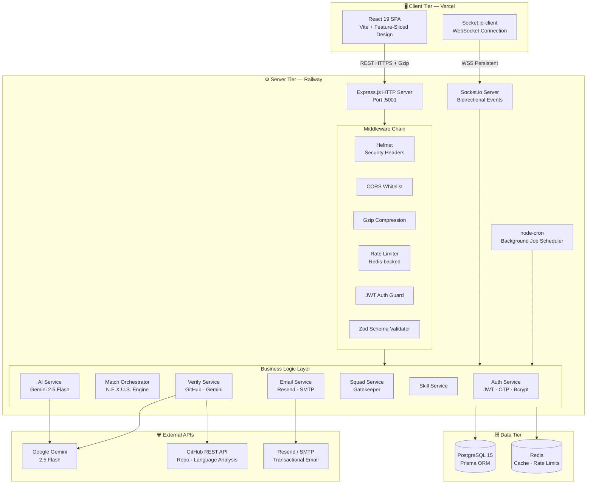

---

## 5.2 Backend Component Architecture

The backend follows a **layered, service-oriented design**. Routes are thin controllers that delegate all business logic to dedicated service classes. Repositories (Prisma queries) are co-located with services, not separated into a DAO layer.

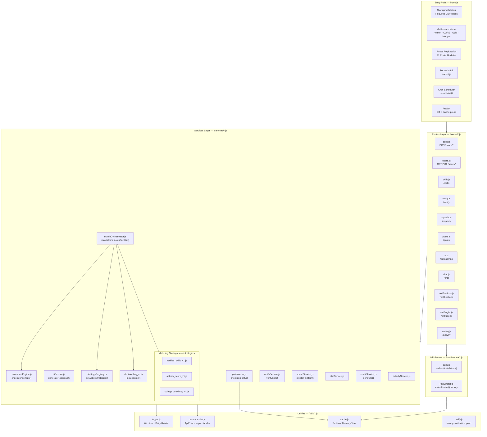

---

## 5.3 Frontend Architecture

The client is a **Feature-Sliced Design (FSD)** React 19 application. Code is organised by business domain, not by technical type. Each feature folder owns its own components, hooks, and API calls.

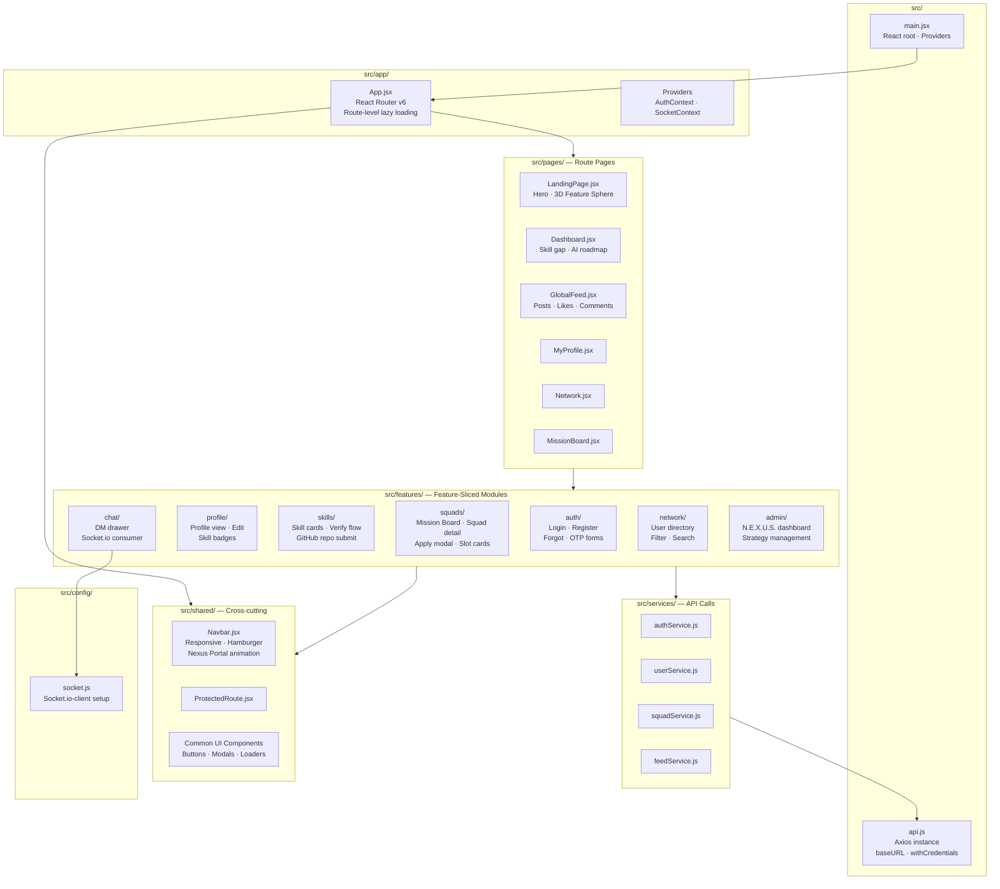

---

## 5.4 Database Architecture

PostgreSQL 15 managed via **Prisma ORM**. The schema is partitioned into five logical domains: Identity, Skills, Social Feed, Squad/Mission System, and the Antifragile Matching Engine.

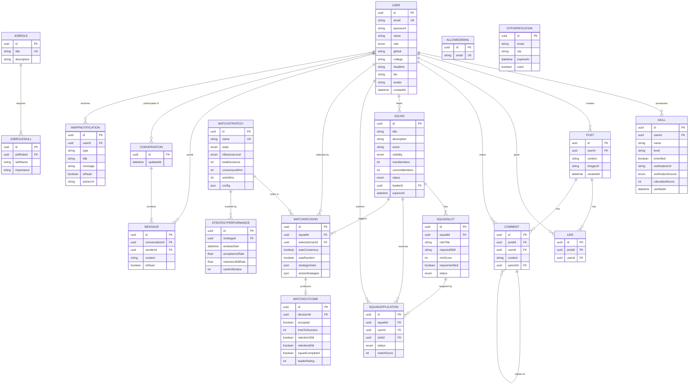

---

## 5.5 Authentication Flow

SkillSphere uses a **two-step OTP → JWT Cookie** model. Registration is gated behind email OTP verification. Session tokens are stored in `httpOnly` cookies that are never accessible to JavaScript, preventing XSS-based token theft.

```mermaid
sequenceDiagram
    autonumber
    actor User
    participant Client as React Client
    participant Auth as /api/auth
    participant Email as Email Service
    participant DB as PostgreSQL

    rect rgb(20, 40, 80)
        Note over User,DB: REGISTRATION FLOW
        User->>Client: Fills form (email, name, role, password)
        Client->>Auth: POST /api/auth/send-otp
        Auth->>DB: Check email not already registered
        DB-->>Auth: Not found OK
        Auth->>Email: sendOtp() — generate 6-digit OTP, persist OtpVerification
        Email-->>User: OTP email delivered

        User->>Client: Enters OTP
        Client->>Auth: POST /api/auth/register with OTP
        Auth->>Auth: Zod schema validation
        Auth->>DB: verifyOtp() — check expiry + used flag
        DB-->>Auth: OTP valid
        Auth->>Auth: bcrypt.hash(password, 12)
        Auth->>DB: prisma.user.create()
        Auth->>DB: ActivityLog ACCOUNT_CREATED
        Auth->>Auth: jwt.sign payload 7d expiry
        Auth-->>Client: Set-Cookie ss_token httpOnly Secure SameSite=None
        Auth-->>Client: 201 user object
    end

    rect rgb(20, 60, 40)
        Note over User,DB: LOGIN FLOW
        User->>Client: Enters email and password
        Client->>Auth: POST /api/auth/login
        Auth->>Auth: Zod validate and authLimiter 50 req per 15 min
        Auth->>DB: findUser by email case-insensitive
        DB-->>Auth: User record
        Auth->>Auth: bcrypt.compare password vs hash
        Auth->>DB: ActivityLog USER_LOGIN
        Auth->>Auth: jwt.sign 7d
        Auth-->>Client: Set-Cookie ss_token
        Auth-->>Client: 200 user object
    end

    rect rgb(60, 20, 40)
        Note over User,DB: SESSION VERIFY — every page load
        Client->>Auth: GET /api/auth/verify — cookie auto-sent
        Auth->>Auth: authenticateToken() jwt.verify
        Auth->>DB: prisma.user.findUnique
        Auth-->>Client: 200 valid true plus user
    end

    rect rgb(40, 20, 60)
        Note over User,DB: PASSWORD RESET
        User->>Client: Forgot Password
        Client->>Auth: POST /api/auth/forgot-password
        Auth->>DB: Check user silently — anti-enumeration
        Auth->>Email: sendOtp()
        Email-->>User: Reset OTP

        User->>Client: Enters OTP and new password
        Client->>Auth: POST /api/auth/reset-password
        Auth->>DB: verifyOtp then bcrypt.hash then user.update
        Auth->>Auth: clearTokenCookie — force re-login
        Auth-->>Client: 200 success
    end
```

---

## 5.6 Request Processing Flow

Every inbound HTTP request passes through a deterministic **middleware chain** before reaching any business logic. This chain handles security hardening, rate limiting, authentication, and validation in that exact order.

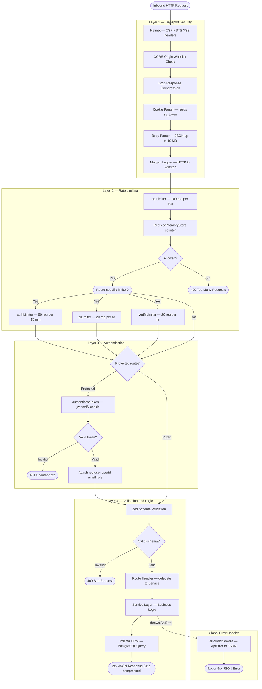

---

## 5.7 Data Flow

This diagram traces how data travels through the system for the five primary platform operations: authentication, squad application, feed post, skill verification, and AI roadmap generation.

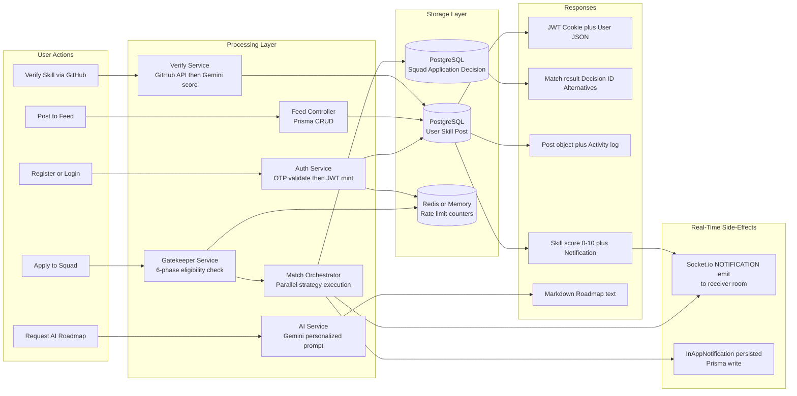

---

## 5.8 N.E.X.U.S. Engine Architecture

The **Antifragile N.E.X.U.S. Engine** is the core differentiator of SkillSphere. It is an evolutionary multi-strategy matching system where algorithms compete, and poor performers are automatically demoted based on real-world retention and acceptance outcomes.

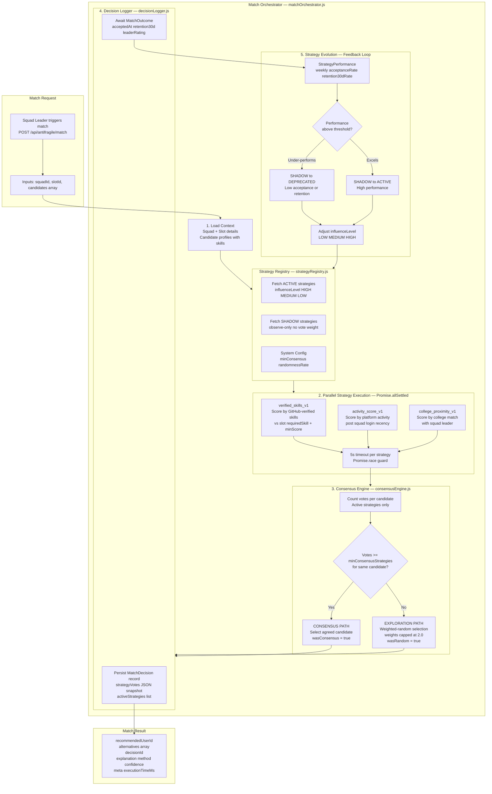

### Visual Overview

---

## 5.9 AI Roadmap Architecture

The AI Roadmap feature pipelines user skill data and target role selection into a **context-aware Gemini 2.5 Flash prompt**, returning a structured personalised Markdown learning plan. Skill verification also uses Gemini for repository code analysis.

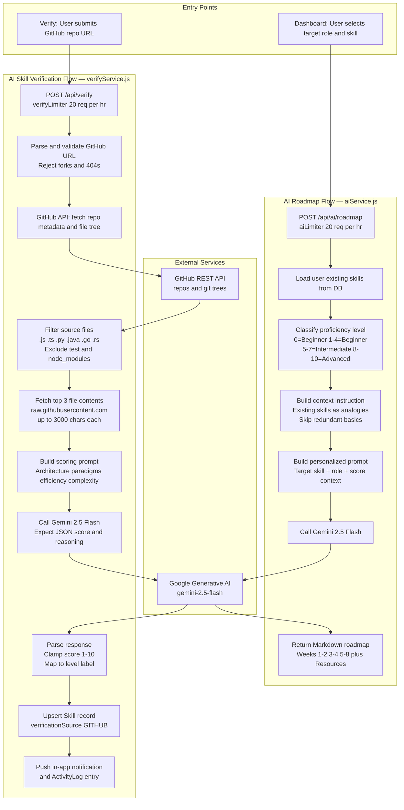

---

## 5.10 Real-Time Communication

SkillSphere uses **Socket.io** co-located with the HTTP server on the same port. Authentication is enforced at the WebSocket handshake level using the same `ss_token` httpOnly cookie. Every connected user joins a private room keyed by their `userId`.

```mermaid
sequenceDiagram
    autonumber
    actor Alice
    participant AC as Alice Client
    participant SRV as Socket.io Server
    participant DB as PostgreSQL
    actor Bob

    rect rgb(20, 40, 80)
        Note over Alice,SRV: HANDSHAKE AND AUTH
        Alice->>AC: Opens SkillSphere while logged in
        AC->>SRV: WSS connect with cookie ss_token
        SRV->>SRV: io.use() middleware jwt.verify cookie
        SRV->>SRV: socket.join(alice.userId) — private room
        SRV-->>AC: Connection acknowledged
    end

    rect rgb(20, 60, 40)
        Note over Alice,DB: SEND MESSAGE
        Alice->>AC: Types message to Bob
        AC->>SRV: emit SEND_MESSAGE receiverId content
        SRV->>DB: findFirst Conversation where Alice and Bob both participate
        alt No existing conversation
            DB-->>SRV: null
            SRV->>DB: create Conversation with both participants
        end
        SRV->>DB: create Message with conversationId senderId content
        DB-->>SRV: Message record with sender details
        SRV->>DB: update Conversation.updatedAt
        SRV->>DB: create InAppNotification for Bob
        SRV->>SRV: io.to(bobId).emit NOTIFICATION
        SRV->>SRV: io.to(bobId).emit RECEIVE_MESSAGE
        SRV->>SRV: io.to(aliceId).emit RECEIVE_MESSAGE
    end

    rect rgb(60, 20, 40)
        Note over Bob,SRV: BOB RECEIVES
        SRV-->>Bob: RECEIVE_MESSAGE event
        SRV-->>Bob: NOTIFICATION event with title and actionUrl
        Bob->>Bob: Notification bell increments and chat updates live
    end

    rect rgb(40, 40, 20)
        Note over SRV: Other real-time events emitted via io.to(userId).emit
        Note over SRV: Squad accepted — NOTIFICATION
        Note over SRV: Skill verified — NOTIFICATION
        Note over SRV: Application status change — NOTIFICATION
    end
```

---

## 5.11 Deployment Architecture

SkillSphere's production topology follows a **split-host** deployment: the React SPA is deployed to **Vercel** (global CDN edge), and the Node.js API runs on **Railway** with PM2 cluster mode across all available CPU cores.

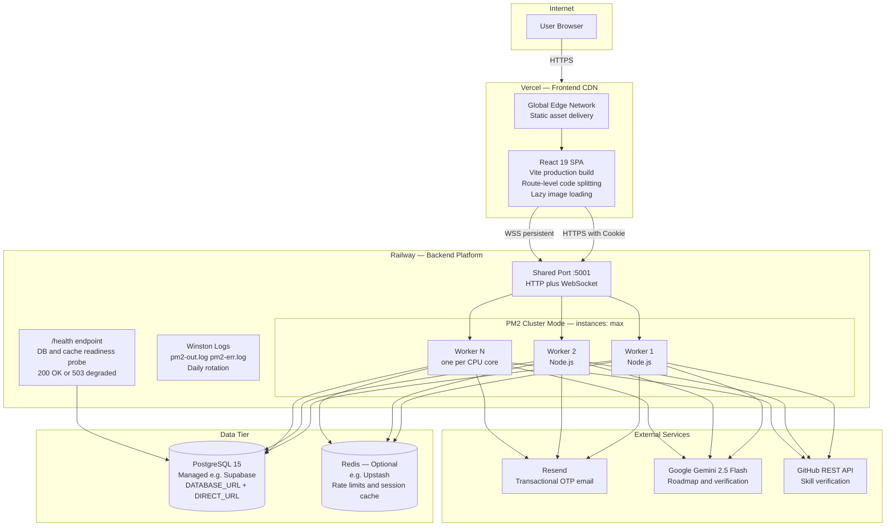

### Environment Variables Reference

| Variable | Required | Purpose |
|----------|----------|---------|
| `DATABASE_URL` | ✅ | Prisma pooled connection string |
| `DIRECT_URL` | ✅ | Prisma direct connection for migrations |
| `JWT_SECRET` | ✅ | HMAC secret for token signing |
| `GOOGLE_API_KEY` | ✅ | Gemini AI for roadmap and verification |
| `REDIS_URL` | ⚠️ Optional | Redis cache (falls back to in-memory) |
| `RESEND_API_KEY` | ⚠️ Optional | Resend email (falls back to SMTP) |
| `SMTP_HOST / USER / PASS` | ⚠️ Optional | SMTP fallback for OTP delivery |
| `GITHUB_TOKEN` | ⚠️ Optional | Avoids GitHub API rate limits |
| `ALLOWED_ORIGINS` | ⚠️ Optional | Extra CORS origins comma-separated |
| `NODE_ENV` | ✅ | `production` enables secure cookies |
| `PORT` | ⚠️ Optional | Defaults to `5001` |

---

## 5.12 Background Jobs

SkillSphere uses **node-cron** for scheduled maintenance. All jobs run in-process alongside the main server. A dedicated worker process is planned for v3.0.

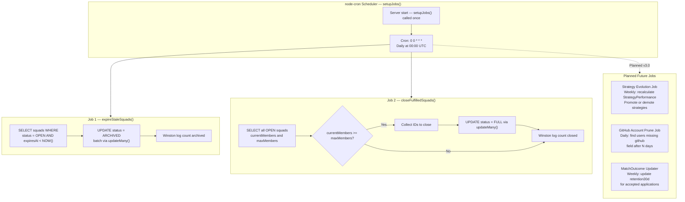

---

## 5.13 Future Scalability

This diagram illustrates the target production-hardened architecture planned for SkillSphere v3.0, incorporating horizontal API scaling, a dedicated Redis Pub/Sub layer for sockets, a message queue for background workers, and a full observability stack.

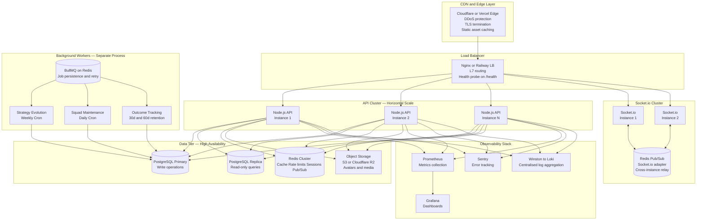

### Scalability Milestones

| Phase | Target Users | Key Changes |
|-------|-------------|-------------|
| **v2.0 — Current** | ~1K | PM2 cluster, single DB, in-memory rate limit fallback |
| **v2.5 — Near-term** | ~10K | Redis required, PostgreSQL read replica, Docker Compose |
| **v3.0 — Mid-term** | ~100K | BullMQ workers, Redis Pub/Sub sockets, S3 media, observability |
| **v4.0 — Long-term** | 1M+ | Microservices split, Kafka event bus, CDN media pipeline |

---

*SkillSphere Architecture Document — © 2026 Kshitiz Dixit. All Rights Reserved.*
