# SkillSphere — System Architecture

> **Document Version:** 2.0  
> **Last Updated:** July 2026  
> **Author:** Kshitiz Dixit  
> **Status:** Production

---

## Table of Contents

| # | Section |
|---|---------|
| 5.1 | [High-Level System Architecture](#51-high-level-system-architecture) |
| 5.2 | [Backend Component Architecture](#52-backend-component-architecture) |
| 5.3 | [Frontend Architecture](#53-frontend-architecture) |
| 5.4 | [Database Architecture](#54-database-architecture) |
| 5.5 | [Authentication Flow](#55-authentication-flow) |
| 5.5.1 | [Quality Control & Account Purge Lifecycle](#551-proof-of-work-quality-control--account-purge-lifecycle) |
| 5.6 | [Request Processing Flow](#56-request-processing-flow) |
| 5.7 | [Data Flow](#57-data-flow) |
| 5.8 | [N.E.X.U.S. Engine Architecture](#58-nexus-engine-architecture) |
| 5.9 | [AI Roadmap & Verification Architecture](#59-ai-roadmap--verification-architecture) |
| 5.10 | [Real-Time Communication](#510-real-time-communication) |
| 5.11 | [Deployment Architecture](#511-deployment-architecture) |
| 5.12 | [Background Jobs](#512-background-jobs) |
| 5.13 | [Future Scalability](#513-future-scalability) |

---

## 5.1 High-Level System Architecture

SkillSphere is a **decoupled, full-stack platform** supporting dual deployment topologies (Vercel/Railway PaaS split-host or AWS EC2 containerized Docker Compose with Nginx). A WebSocket layer runs co-located with the Express HTTP server. All persistent state lives in a managed PostgreSQL database (via Prisma ORM), with Redis/in-memory cache serving as an acceleration and rate-limit store.

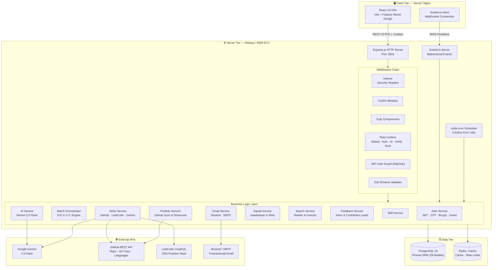

---

## 5.2 Backend Component Architecture

The backend follows a **layered, service-oriented design**. Routes are thin controllers that delegate all business logic to dedicated service classes. Repositories (Prisma queries) are co-located with services, not separated into a DAO layer.

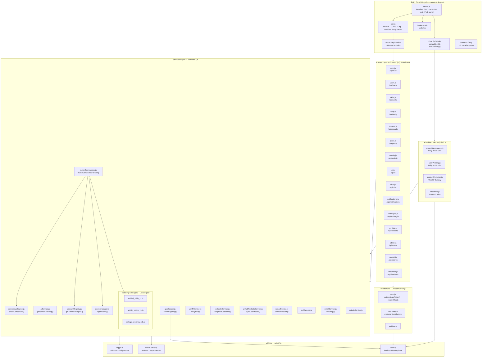

---

## 5.3 Frontend Architecture

The client is a **Feature-Sliced Design (FSD)** React 19 application. Code is organised by business domain, not by technical type. Each feature folder owns its own components, hooks, and API calls.

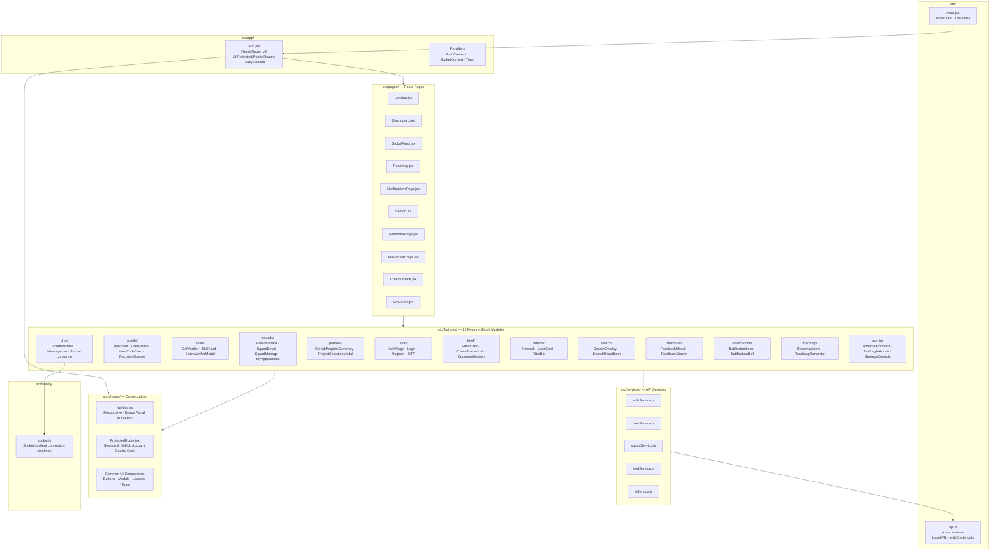

---

## 5.4 Database Architecture

PostgreSQL 16 managed via **Prisma ORM**. The schema contains **28 models** partitioned across eight logical domains: Core Identity, Skills & GitHub Repositories, Career Roadmaps, Social Feed & Moderation, Squad/Mission System, Antifragile Matching Engine (N.E.X.U.S.), Chat & Messaging, and Community Feedback.

```mermaid
erDiagram
    USER {
        uuid    id           PK
        string  email        UK
        string  password
        string  name
        enum    role
        string  guestPersona
        string  college
        string  headline
        string  bio
        string  avatar
        string  github
        string  linkedin
        string  leetcodeUsername
        int     leetcodeDSAScore
        string  leetcodeDSALevel
        int     leetcodeTotalPoints
        json    leetcodeLanguages
        datetime leetcodeSyncedAt
        boolean isActive
        datetime createdAt
    }

    SKILL {
        uuid    id              PK
        uuid    userId          FK
        string  name
        string  level
        boolean isVerified
        string  verificationUrl
        enum    verificationSource
        int     calculatedScore
        boolean showLevel
        datetime verifiedAt
    }

    GITHUBREPO {
        uuid     id              PK
        uuid     userId          FK
        string   repoName
        string   fullName
        string   primaryLanguage
        string[] techStack
        int      stars
        int      forks
        string   url
        enum     repoType
        boolean  isSelected
        int      mergedPrs
        datetime repoUpdatedAt
    }

    ROADMAP {
        uuid     id             PK
        uuid     userId         FK
        string   targetRole
        string   targetSkill
        string   content
        string[] completedItems
        float    progress
        string   shareToken     UK
        datetime generatedAt
        datetime updatedAt
    }

    JOBROLE {
        uuid    id          PK
        string  title       UK
        string  description
    }

    JOBROLESKILL {
        uuid    id         PK
        uuid    jobRoleId  FK
        string  skillName
        string  importance
    }

    POST {
        uuid     id        PK
        uuid     userId    FK
        string   content
        string   imageUrl
        datetime createdAt
    }

    LIKE {
        uuid     id        PK
        uuid     postId    FK
        uuid     userId    FK
    }

    COMMENT {
        uuid     id       PK
        uuid     postId   FK
        uuid     userId   FK
        string   content
        uuid     parentId FK
        datetime createdAt
    }

    COMMENTLIKE {
        uuid     id        PK
        uuid     commentId FK
        uuid     userId    FK
        datetime createdAt
    }

    CONTENTREPORT {
        uuid     id              PK
        uuid     reporterId      FK
        uuid     targetUserId
        uuid     targetPostId
        uuid     targetCommentId
        string   reason
        enum     status
        string   resolution
        datetime reportedAt
    }

    ACTIVITYLOG {
        uuid     id        PK
        uuid     userId    FK
        string   action
        string   details
        datetime createdAt
    }

    SQUAD {
        uuid     id             PK
        string   title
        string   description
        string   event
        enum     visibility
        int      maxMembers
        int      currentMembers
        enum     status
        uuid     leaderId       FK
        datetime expiresAt
    }

    SQUADSLOT {
        uuid     id              PK
        uuid     squadId         FK
        string   roleTitle
        string   roleDescription
        string[] preferredSkills
        string   requiredSkill
        int      minScore
        boolean  requireVerified
        enum     status
        string   filledBy
    }

    SQUADAPPLICATION {
        uuid     id              PK
        uuid     squadId         FK
        uuid     userId          FK
        uuid     slotId          FK
        string   message
        enum     status
        int      matchScore
        uuid     matchDecisionId FK
        datetime appliedAt
    }

    MATCHSTRATEGY {
        uuid     id             PK
        string   name           UK
        string   displayName
        string   description
        enum     state
        enum     influenceLevel
        int      totalDecisions
        int      consensusWins
        int      soloWins
        json     config
    }

    MATCHDECISION {
        uuid     id               PK
        uuid     squadId          FK
        uuid     selectedUserId   FK
        string[] alternativesShown
        boolean  wasConsensus
        boolean  wasRandom
        int      consensusCount
        json     strategyVotes
        json     activeStrategies
    }

    MATCHOUTCOME {
        uuid     id             PK
        uuid     decisionId     FK
        boolean  accepted
        datetime acceptedAt
        int      timeToDecision
        boolean  retention30d
        boolean  retention60d
        boolean  squadCompleted
        int      leaderRating
    }

    STRATEGYPERFORMANCE {
        uuid     id             PK
        uuid     strategyId     FK
        datetime windowStart
        datetime windowEnd
        float    acceptanceRate
        float    retention30dRate
        int      rankInWindow
    }

    STRATEGYPROMOTION {
        uuid     id          PK
        uuid     strategyId  FK
        enum     fromState
        enum     toState
        string   reason
        json     metrics
        datetime triggeredAt
    }

    SYSTEMCONFIG {
        uuid     id                     PK
        int      maxActiveStrategies
        int      maxShadowStrategies
        float    minRandomnessRate
        int      minConsensusStrategies
        int      influenceDecayDays
    }

    CONVERSATION {
        uuid     id        PK
        datetime updatedAt
    }

    MESSAGE {
        uuid     id             PK
        uuid     conversationId FK
        uuid     senderId       FK
        string   content
        boolean  isRead
        datetime createdAt
    }

    INAPPNOTIFICATION {
        uuid     id           PK
        uuid     userId       FK
        string   type
        string   title
        string   message
        boolean  isRead
        string   actionUrl
        string   senderAvatar
        datetime createdAt
    }

    ALLOWEDEMAIL {
        uuid     id    PK
        string   email UK
    }

    OTPVERIFICATION {
        uuid     id        PK
        string   email
        string   otp
        datetime expiresAt
        boolean  used
    }

    FOLLOW {
        uuid     id          PK
        uuid     followerId  FK
        uuid     followingId FK
        datetime createdAt
    }

    PLATFORMFEEDBACK {
        uuid     id                 PK
        uuid     userId
        string   userName
        string   userEmail
        string   category
        int      rating
        string   feedback
        boolean  wantsToContribute
        string[] contributorAreas
        string   status
        string   adminResponse
        datetime createdAt
    }

    USER             ||--o{ SKILL                : "possesses"
    USER             ||--o{ GITHUBREPO           : "syncs"
    USER             ||--o{ POST                 : "creates"
    USER             ||--o{ LIKE                 : "gives"
    USER             ||--o{ COMMENT              : "writes"
    USER             ||--o{ COMMENTLIKE          : "likes comment"
    USER             ||--o{ CONTENTREPORT        : "files report"
    USER             ||--o{ ACTIVITYLOG          : "generates"
    USER             ||--o{ SQUAD                : "leads"
    USER             ||--o{ SQUADAPPLICATION     : "submits"
    USER             ||--o{ MATCHDECISION        : "selected by"
    USER             ||--o{ ROADMAP              : "generates"
    USER             ||--o{ MESSAGE              : "sends"
    USER             }o--o{ CONVERSATION         : "participates in"
    USER             ||--o{ INAPPNOTIFICATION    : "receives"
    USER             ||--o{ FOLLOW               : "follows / followed by"
    POST             ||--o{ LIKE                 : "has"
    POST             ||--o{ COMMENT              : "has"
    COMMENT          ||--o{ COMMENT              : "replies to"
    COMMENT          ||--o{ COMMENTLIKE          : "receives likes"
    SQUAD            ||--|{ SQUADSLOT            : "has"
    SQUAD            ||--o{ SQUADAPPLICATION     : "receives"
    SQUAD            ||--o{ MATCHDECISION        : "triggers"
    SQUADSLOT        ||--o{ SQUADAPPLICATION     : "targeted by"
    MATCHDECISION    ||--o| MATCHOUTCOME         : "produces"
    MATCHDECISION    ||--o| SQUADAPPLICATION     : "links"
    MATCHSTRATEGY    ||--o{ MATCHDECISION        : "votes in"
    MATCHSTRATEGY    ||--o{ STRATEGYPERFORMANCE  : "tracked by"
    MATCHSTRATEGY    ||--o{ STRATEGYPROMOTION    : "audits changes"
    JOBROLE          ||--|{ JOBROLESKILL         : "requires"
    CONVERSATION     ||--|{ MESSAGE              : "contains"
```

---

## 5.5 Authentication Flow

SkillSphere uses a **two-step OTP → JWT Cookie** model. Registration is gated behind email OTP verification. Session tokens are stored in `httpOnly` cookies that are never accessible to JavaScript, preventing XSS-based token theft.

```mermaid
sequenceDiagram
    autonumber
    actor User
    participant Client as React Client
    participant Auth as /api/auth
    participant Email as Email Service
    participant DB as PostgreSQL

    rect rgb(20, 40, 80)
        Note over User,DB: REGISTRATION FLOW
        User->>Client: Fills form (email, name, role, password)
        Client->>Auth: POST /api/auth/send-otp
        Auth->>DB: Check email not already registered
        DB-->>Auth: Not found OK
        Auth->>Email: sendOtp() — generate 6-digit OTP, persist OtpVerification
        Email-->>User: OTP email delivered

        User->>Client: Enters OTP
        Client->>Auth: POST /api/auth/register with OTP
        Auth->>Auth: Zod schema validation
        Auth->>DB: verifyOtp() — check expiry + used flag
        DB-->>Auth: OTP valid
        Auth->>Auth: bcrypt.hash(password, 12)
        Auth->>DB: prisma.user.create()
        Auth->>DB: ActivityLog ACCOUNT_CREATED
        Auth->>Auth: jwt.sign payload 7d expiry
        Auth-->>Client: Set-Cookie ss_token httpOnly Secure SameSite=None
        Auth-->>Client: 201 user object
    end

    rect rgb(20, 60, 40)
        Note over User,DB: LOGIN FLOW
        User->>Client: Enters email and password
        Client->>Auth: POST /api/auth/login
        Auth->>Auth: Zod validate and authLimiter 50 req per 15 min
        Auth->>DB: findUser by email case-insensitive
        DB-->>Auth: User record
        Auth->>Auth: bcrypt.compare password vs hash
        Auth->>DB: ActivityLog USER_LOGIN
        Auth->>Auth: jwt.sign 7d
        Auth-->>Client: Set-Cookie ss_token
        Auth-->>Client: 200 user object
    end

    rect rgb(60, 20, 40)
        Note over User,DB: SESSION VERIFY — every page load
        Client->>Auth: GET /api/auth/verify — cookie auto-sent
        Auth->>Auth: authenticateToken() jwt.verify
        Auth->>DB: prisma.user.findUnique
        Auth-->>Client: 200 valid true plus user
    end

    rect rgb(40, 20, 60)
        Note over User,DB: PASSWORD RESET
        User->>Client: Forgot Password
        Client->>Auth: POST /api/auth/forgot-password
        Auth->>DB: Check user silently — anti-enumeration
        Auth->>Email: sendOtp()
        Email-->>User: Reset OTP

        User->>Client: Enters OTP and new password
        Client->>Auth: POST /api/auth/reset-password
        Auth->>DB: verifyOtp then bcrypt.hash then user.update
        Auth->>Auth: clearTokenCookie — force re-login
        Auth-->>Client: 200 success
    end

    rect rgb(30, 50, 60)
        Note over User,DB: GUEST EXPLORATION LOGIN
        User->>Client: Clicks "Explore as Student / Professional"
        Client->>Auth: POST /api/auth/guest { role: "STUDENT" | "PROFESSIONAL" }
        Auth->>DB: Find or create seeded guest persona user
        Auth->>Auth: jwt.sign payload with 24h expiration
        Auth-->>Client: Set-Cookie ss_token + 200 user object
    end
```

### 5.5.1 Proof-of-Work Quality Control & Account Purge Lifecycle

SkillSphere enforces an uncompromising **Proof-of-Work Quality Gate**: accounts that do not link a valid GitHub account are restricted from accessing protected platform routes and automatically purged. This prevents ghost profiles and ensures all network participants possess verifiable engineering artifacts.

```mermaid
sequenceDiagram
    autonumber
    actor User
    participant Browser as React Client (App.jsx)
    participant API as Express API (/api/users/me)
    participant Cron as Cron Job (userPruning.js)
    participant DB as PostgreSQL

    rect rgb(60, 30, 30)
        Note over User,DB: PATHWAY A — REAL-TIME ROUTE PURGE INTERCEPTOR
        User->>Browser: Navigates to protected route (/dashboard, /nexus, /grid)
        Browser->>Browser: Evaluates Gate: hasGithub || isSystemOrAdmin
        alt GitHub account NOT linked (github == null / empty)
            Browser->>Browser: Warns: Quality Control: GitHub account not linked
            Browser->>API: DELETE /api/users/me (Hard delete request)
            API->>DB: prisma.user.delete({ where: { id: req.user.userId } })
            DB-->>API: User record and cascade relations purged
            API-->>Browser: 200 OK
            Browser->>Browser: Wipe localStorage (user_data, ss_token)
            Browser->>User: Redirect to /auth?reason=github_required
        else GitHub account linked
            Browser->>User: Renders protected page
        end
    end

    rect rgb(50, 40, 20)
        Note over Cron,DB: PATHWAY B — SCHEDULED BACKGROUND SWEEPER
        Cron->>Cron: Scheduled at 01:00 UTC daily & on startup
        Cron->>DB: DELETE FROM "User" WHERE (github IS NULL OR github = '') AND createdAt < (NOW() - 24h)
        DB-->>Cron: Returns count of pruned accounts
        Cron->>Cron: Winston logs: "removed accounts missing GitHub link"
    end
```

---

## 5.6 Request Processing Flow

Every inbound HTTP request passes through a deterministic **middleware chain** before reaching any business logic. This chain handles security hardening, rate limiting, authentication, and validation in that exact order.

---

## 5.7 Data Flow

This diagram traces how data travels through the system for the primary platform operations: authentication & guest access, squad recruitment, feed discussions, GitHub AI code audit, LeetCode DSA verification, portfolio showcase synchronization, AI career roadmap generation, and unified search.

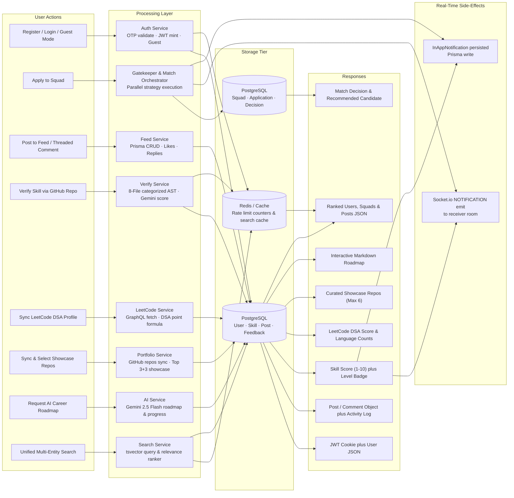

---

## 5.8 N.E.X.U.S. Engine Architecture

The **Antifragile N.E.X.U.S. Engine** is the core differentiator of SkillSphere. It is an evolutionary multi-strategy matching system where algorithms compete, and poor performers are automatically demoted based on real-world retention and acceptance outcomes.

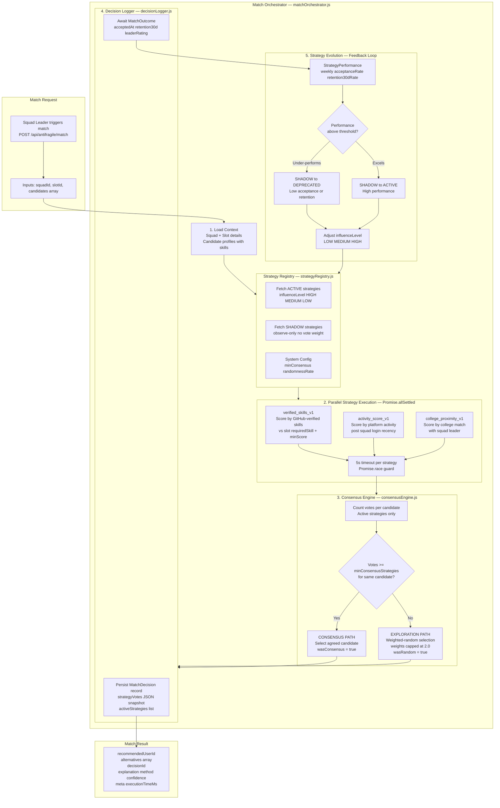

### Visual Overview

---

## 5.9 AI Roadmap & Verification Architecture

The AI Roadmap feature pipelines user skill data and target role selection into a **context-aware Gemini 2.5 Flash prompt**, returning a structured personalised Markdown learning plan with interactive milestone tracking. Skill verification uses multi-source validation: GitHub categorized AST inspection with prompt injection defense, and LeetCode algorithmic problem evaluation.

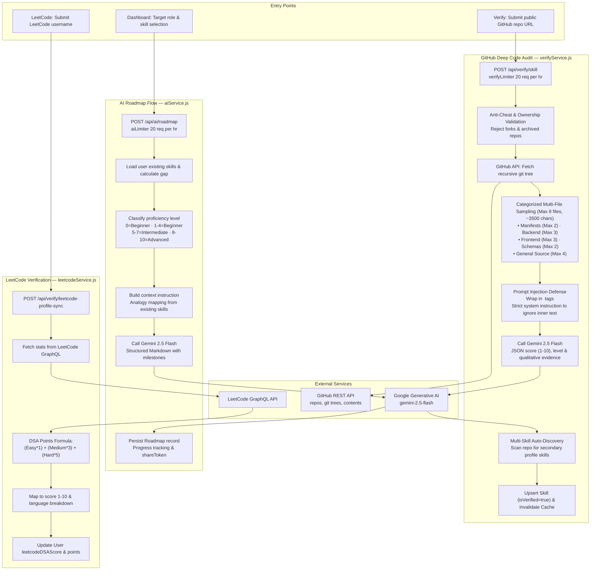

---

## 5.10 Real-Time Communication

SkillSphere uses **Socket.io** co-located with the HTTP server on the same port. Authentication is enforced at the WebSocket handshake level using the same `ss_token` httpOnly cookie. Every connected user joins a private room keyed by their `userId`.

```mermaid
sequenceDiagram
    autonumber
    actor Alice
    participant AC as Alice Client
    participant SRV as Socket.io Server
    participant DB as PostgreSQL
    actor Bob

    rect rgb(20, 40, 80)
        Note over Alice,SRV: HANDSHAKE AND AUTH
        Alice->>AC: Opens SkillSphere while logged in
        AC->>SRV: WSS connect with cookie ss_token
        SRV->>SRV: io.use() middleware jwt.verify cookie
        SRV->>SRV: socket.join(alice.userId) — private room
        SRV-->>AC: Connection acknowledged
    end

    rect rgb(20, 60, 40)
        Note over Alice,DB: SEND MESSAGE
        Alice->>AC: Types message to Bob
        AC->>SRV: emit SEND_MESSAGE receiverId content
        SRV->>DB: findFirst Conversation where Alice and Bob both participate
        alt No existing conversation
            DB-->>SRV: null
            SRV->>DB: create Conversation with both participants
        end
        SRV->>DB: create Message with conversationId senderId content
        DB-->>SRV: Message record with sender details
        SRV->>DB: update Conversation.updatedAt
        SRV->>DB: create InAppNotification for Bob
        SRV->>SRV: io.to(bobId).emit NOTIFICATION
        SRV->>SRV: io.to(bobId).emit RECEIVE_MESSAGE
        SRV->>SRV: io.to(aliceId).emit RECEIVE_MESSAGE
    end

    rect rgb(60, 20, 40)
        Note over Bob,SRV: BOB RECEIVES
        SRV-->>Bob: RECEIVE_MESSAGE event
        SRV-->>Bob: NOTIFICATION event with title and actionUrl
        Bob->>Bob: Notification bell increments and chat updates live
    end

    rect rgb(40, 40, 20)
        Note over SRV: Other real-time events emitted via io.to(userId).emit
        Note over SRV: Squad accepted — NOTIFICATION
        Note over SRV: Skill verified — NOTIFICATION
        Note over SRV: Application status change — NOTIFICATION
    end
```

---

## 5.11 Deployment Architecture

SkillSphere supports **two production deployment topologies**: a managed **PaaS Split-Host** configuration (ideal for continuous frontend CD and serverless scaling) and a self-hosted **Containerized IaaS** configuration on AWS EC2 using Docker Compose (ideal for total systems control, cost containment, and engineering portfolio demonstrations).

### 5.11.1 Topology A: Managed PaaS Split-Host (Vercel + Railway)

In this configuration, the React SPA is deployed to **Vercel** (global CDN edge), and the Node.js API runs on **Railway** with PM2 cluster mode across available CPU cores.

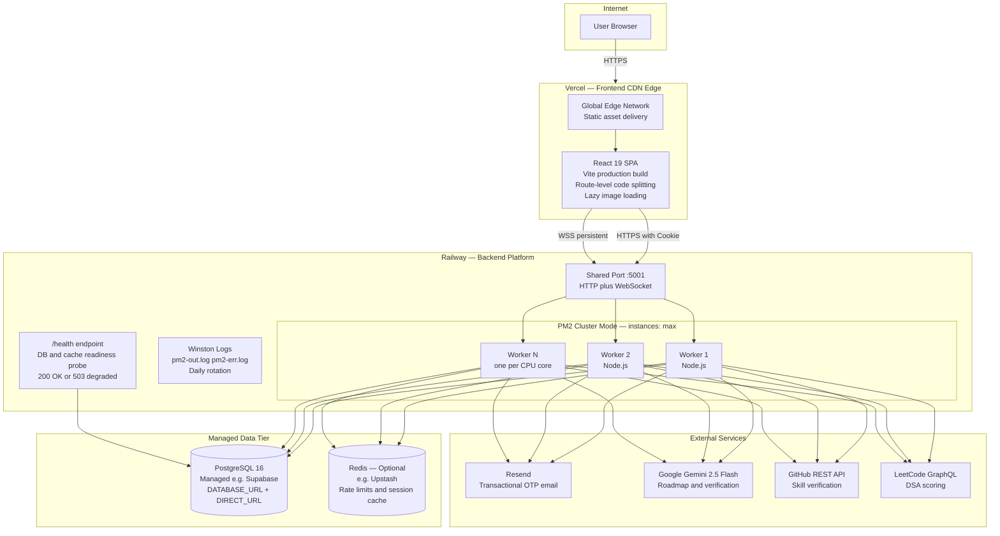

### 5.11.2 Topology B: Containerized IaaS (AWS EC2 + Docker Compose + Nginx)

In this configuration (detailed in [`cloud_deployment.md`](file:///C:/Users/kshit/cs/skillsphere/cloud_deployment.md) and [`containerization.md`](file:///C:/Users/kshit/cs/skillsphere/containerization.md)), the entire application stack runs inside an isolated Docker bridge network on an **AWS EC2 `t2.micro`** instance (1 vCPU, 1 GB RAM, Ubuntu 24.04 LTS) backed by an Elastic Block Store (EBS) persistent volume and a 2 GB Linux Swap file.

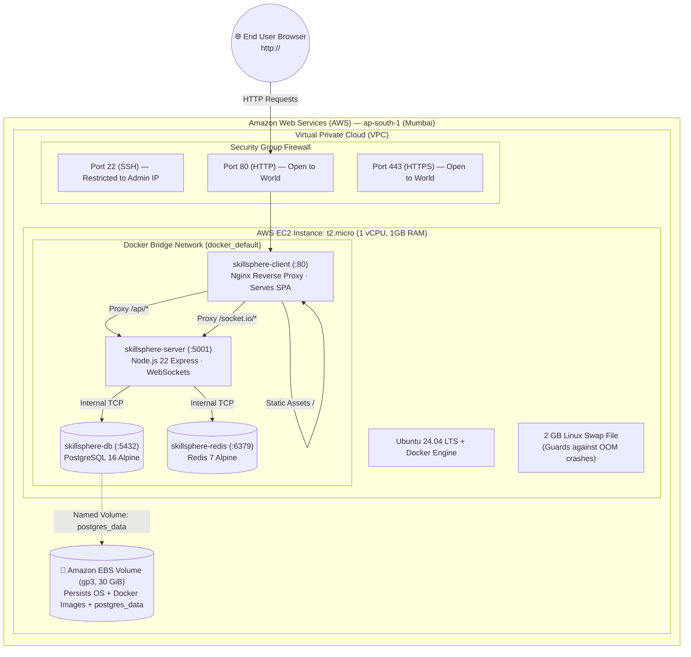

### 5.11.3 Topology Comparison Matrix

| Architectural Feature | Topology A: PaaS (Vercel + Railway) | Topology B: IaaS (AWS EC2 + Docker Compose) |
|:---|:---|:---|
| **Target Audience** | Rapid feature prototyping, global edge CDN | Systems engineering interviews, cost predictability |
| **Reverse Proxy** | Managed by Vercel & Railway routers | Custom Nginx reverse proxy container (`client/nginx.conf`) |
| **CORS Constraint** | Requires cross-origin cookies (`SameSite=None`) | Same-origin proxy on port 80 bypasses CORS entirely |
| **Database Host** | Managed PostgreSQL (Supabase / Neon) | Containerized PostgreSQL 16 Alpine mounted on EBS |
| **Cache & Queue** | Managed Redis (Upstash) / In-memory fallback | Containerized Redis 7 Alpine on bridge network |
| **Resource Overhead** | Managed serverless instances | Hard-limited to 1 vCPU, 1 GB RAM + 2 GB Swap file |
| **Monthly Cost** | Free tiers / usage-based | **₹0 / month** under AWS Free Tier (750h EC2 + 30GB EBS) |

### Environment Variables Reference

| Variable | Required | Purpose |
|----------|----------|---------|
| `DATABASE_URL` | ✅ | Prisma pooled connection string |
| `DIRECT_URL` | ✅ | Prisma direct connection for migrations |
| `JWT_SECRET` | ✅ | HMAC secret for token signing |
| `GOOGLE_API_KEY` | ✅ | Gemini AI for roadmap and verification |
| `REDIS_URL` | ⚠️ Optional | Redis cache (falls back to in-memory) |
| `RESEND_API_KEY` | ⚠️ Optional | Resend email (falls back to SMTP) |
| `SMTP_HOST / USER / PASS` | ⚠️ Optional | SMTP fallback for OTP delivery |
| `GITHUB_TOKEN` | ⚠️ Optional | Avoids GitHub API rate limits |
| `ALLOWED_ORIGINS` | ⚠️ Optional | Extra CORS origins comma-separated |
| `NODE_ENV` | ✅ | `production` enables secure cookies |
| `PORT` | ⚠️ Optional | Defaults to `5001` |

---

## 5.12 Background Jobs

SkillSphere uses **node-cron** for scheduled maintenance and self-healing automation. All 4 background jobs run in-process alongside the main server, initialized on startup via `setupJobs()` in `server/jobs/squadMaintenance.js`.

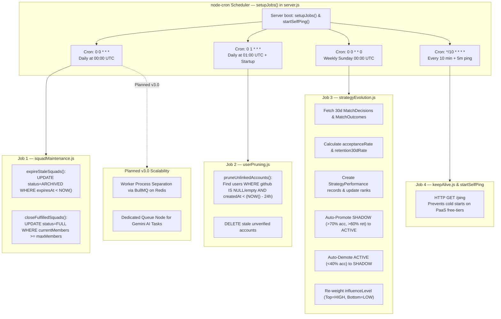

---

## 5.13 Future Scalability

This diagram illustrates the target production-hardened architecture planned for SkillSphere v3.0, incorporating horizontal API scaling, a dedicated Redis Pub/Sub layer for sockets, a message queue for background workers, and a full observability stack.

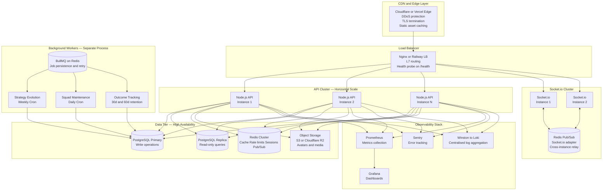

### Scalability Milestones

| Phase | Target Users | Key Changes |
|-------|-------------|-------------|
| **v2.0 — Current** | ~1K | PM2 cluster, single DB, in-memory rate limit fallback |
| **v2.5 — Near-term** | ~10K | Redis required, PostgreSQL read replica, Docker Compose |
| **v3.0 — Mid-term** | ~100K | BullMQ workers, Redis Pub/Sub sockets, S3 media, observability |
| **v4.0 — Long-term** | 1M+ | Microservices split, Kafka event bus, CDN media pipeline |

---

*SkillSphere Architecture Document — © 2026 Kshitiz Dixit. All Rights Reserved.*
