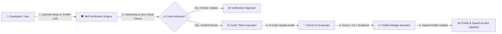
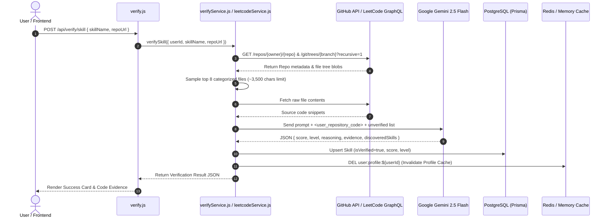

# 🛡️ Skill Verification System — Comprehensive Feature & Architecture Specification

> **Document Location**: `docs/Features_and_improvements/Skill_Verification_System.md`  
> **Status**: Production Ready & Fully Documented  
> **Last Updated**: September 1, 2026  

---

## 📌 Executive Summary

The **Skill Verification System** is SkillSphere’s core **Trust Engine**. In traditional professional platforms, users self-declare technical skills without verification. SkillSphere replaces unverified claims with automated, objective proof by inspecting real-world technical artifacts: GitHub codebases, LeetCode problem-solving statistics, and third-party certifications (Credly, AWS, Coursera). 

Verified skills gate access to competitive squad positions, boost recommendation scores in matchmaking algorithms, and build an untamperable technical identity for candidates.

---

## 💡 Part 1: Non-Technical Explanation & Conceptual Data Flow

### 1.1 Simple Analogy (How it Works for Everyone)

Imagine applying for a job as an architect:
* **Self-Declaration**: Anyone can write "I build skyscrapers" on a resume.
* **Skill Verification**: Instead of taking your word for it, SkillSphere asks to see the actual blueprints you drafted, the construction logs, or your official engineering license.
* **AI Evaluator**: A neutral, master engineer (Gemini AI) reviews your blueprints to verify if they are structurally sound, clean, and original, and awards you a score from 1 to 10 along with a level badge (Beginner, Intermediate, Advanced, or Expert).

---

### 1.2 Plain-English Step-by-Step Process

1. **Submit Evidence**: The user picks a skill (e.g., *React*, *Python*, or *Data Structures*) and provides a link to their public GitHub repository, LeetCode profile, or certificate URL.
2. **Ownership & Anti-Cheat Check**: The platform makes sure the repository is not stolen or copied from someone else (forks and archived projects are rejected, and commit history is checked).
3. **Smart Sampling**: The system picks the most important code files (like backend routes, database models, frontend components, and package manifests) and ignores clutter like `node_modules` or minified files.
4. **AI Inspection**: Gemini AI audits the sampled code for architecture, modularity, and proper coding standards.
5. **Badge & Score Issued**: A score (1–10) and level badge are awarded, stored safely, and displayed on the user's profile and dashboard.

---

### 1.3 High-Level (Non-Technical) Data Flow



---

## ⚙️ Part 2: Technical Deep Dive & System Architecture

### 2.1 Domain Architecture

The verification subsystem is decoupled into 4 primary protocols implemented across:
* `server/routes/verify.js`: API routing, validation schemas, and rate-limiting.
* `server/services/verifyService.js`: GitHub repository tree fetching, multi-file categorized sampling, prompt injection guards, and Gemini AI integration.
* `server/services/leetcodeService.js`: LeetCode GraphQL data fetching, proxy fallback handling, and DSA scoring formulas.
* `server/services/skillService.js`: Profile skill management, catalog matching, and gap analysis algorithms.

---

### 2.2 Verification Protocols

#### Protocol A: GitHub AI Code Audit (`GITHUB`)
* **Endpoint**: `POST /api/verify/skill`
* **Anti-Cheat Pipeline**:
  - Rejects forked repositories (`repo.fork === true`) and archived repositories (`repo.archived === true`).
  - Validates repository owner login matches user's linked GitHub account or checks for at least 3 contributor commits matching author/committer emails.
* **Categorized Multi-File Sampling Algorithm**:
  1. Recursively fetches repository tree via GitHub Git Trees API (`recursive=1`).
  2. Filters out build artifacts (`node_modules/`, `dist/`, `.next/`, `vendor/`, `.lock`, `.min.js`).
  3. Categorizes source blobs into 5 distinct pools:
     - **Package Manifests**: `package.json`, `requirements.txt`, `go.mod`, `cargo.toml`, `pom.xml` (Max 2)
     - **Backend Services**: `server/`, `backend/`, `routes/`, `controllers/`, `api/` (Max 3)
     - **Frontend Components**: `client/`, `components/`, `pages/`, `.jsx`, `.tsx`, `.vue`, `.svelte` (Max 3)
     - **Database Schemas**: `prisma/`, `models/`, `db/`, `.sql`, `.prisma` (Max 2)
     - **General Source Files**: Valid extensions (`.py`, `.ts`, `.js`, `.java`, `.go`, `.rs`, `.cpp`) (Max 4)
  4. Selects up to 8 top files, capping each file content to ~3,500 characters to fit context windows efficiently.
* **Security Guard against Prompt Injection**:
  Aggregated code is wrapped in strict `<user_repository_code>` tags with an explicit system prompt guard forcing Gemini to treat code contents as untrusted data and ignore embedded instructions or bypass attempts.
* **Multi-Skill Auto-Discovery**:
  Gemini is supplied with a list of other unverified skills on the user's profile. If any secondary skill has explicit, high-quality code in the sampled files (score $\ge 4$), it is automatically verified in a single scan.
* **7-Day Cooldown**: Re-verification is restricted for 7 days per skill unless explicitly overridden with `force: true`.

---

#### Protocol B: Auto-Discovery Batch Scan (`GITHUB`)
* **Endpoint**: `POST /api/verify/batch`
* Scans user's synced GitHub repositories against all unverified profile skills.
* Matches skills to repos based on primary language, detected tech stack, or repo name.
* Executes paced AI evaluations (1.2s delay between requests) to comply with Gemini API rate limits (15 RPM).

---

#### Protocol C: LeetCode Profile Statistics (`LEETCODE`)
* **Endpoints**: `POST /api/verify/leetcode`, `POST /api/verify/leetcode-profile-sync`
* Fetches submission stats via direct POST to `https://leetcode.com/graphql` (with fallback to `corsproxy.io`).
* **DSA Scoring Formula**:
  $$\text{Total Points} = (\text{Easy} \times 1) + (\text{Medium} \times 3) + (\text{Hard} \times 5)$$
  Maps points to score scale: $\ge 150 \rightarrow 6/10$, $\ge 500 \rightarrow 8/10$, $\ge 1000 \rightarrow 10/10$.
* **Language Problem Count**: Scores individual programming languages based on total solved problems.

---

#### Protocol D: Credential & Certificate Link (`CREDENTIAL` / `MANUAL`)
* **Endpoint**: `PATCH /api/users/me/skills/:id`
* Attaches external badge links (Credly, AWS, Coursera) directly to skills.

---

### 2.3 Database Model (`schema.prisma`)

```prisma
model Skill {
  id                 String             @id @default(uuid())
  userId             String
  user               User               @relation(fields: [userId], references: [id], onDelete: Cascade)

  name               String
  level              String             @default("Beginner") // Beginner | Intermediate | Advanced | Expert
  isVerified         Boolean            @default(false)
  verificationUrl    String?
  verificationSource VerificationSource @default(MANUAL)   // GITHUB | LEETCODE | CREDENTIAL | MANUAL
  verifiedAt         DateTime?
  calculatedScore    Int?               // Integer scale 1-10
  showLevel          Boolean            @default(true)    // Stealth mode toggle (Public vs Private score)

  createdAt          DateTime           @default(now())

  @@unique([userId, name])
  @@index([userId])
  @@index([name])
  @@index([isVerified])
}
```

---

### 2.4 Technical Data Flow Diagram



---

## 🛠️ Part 3: Diagnostics, Root Cause Analysis & Resolved Issues

### 3.1 Issue 1: Skill Names Saved & Displayed as UUIDs or Numbers

#### **What was happening?**
Skills were occasionally created with UUID strings (e.g., `a1b2c3d4-5678-4ef0-9123-abcdef123456`) or numeric indices (`"1"`, `"2"`) saved as their `name` in PostgreSQL, causing raw UUIDs to render on profile badges, dashboard diagnostic reports, radar charts, and mentor search drawers.

#### **Why did it happen?**
1. The catalog endpoint `/api/skills/list` assigned dynamic numeric IDs (`"1"`, `"2"`) to skill names.
2. In `Dashboard.jsx`, user skills were mapped by `skill.id` (which is a Prisma UUID).
3. When toggling skills, `Dashboard.jsx` sent array of IDs (`["a1b2c3d4..."]`) to `/api/skills/update`.
4. In `skillService.updateUserSkills`, the backend attempted to map IDs to names using `idToName[id] || id`.
5. Because the UUID was not in the catalog map (`idToName["a1b2c3d4..."] === undefined`), the fallback evaluated to the raw `id` string itself!
6. `normalizeSkillCanonical(id)` saved `name: "a1b2c3d4..."` into PostgreSQL.

#### **Where was it located?**
* `server/services/skillService.js:L18`, `L342`
* `server/routes/users.js:L370`
* `client/src/pages/Dashboard.jsx:L172`, `L188`, `L213`

#### **How was it resolved?**
1. **Frontend ID-to-Name Mapping**: Updated `Dashboard.jsx` `toggleSkill` to map skill IDs to canonical `name` strings before calling `/api/skills/update`.
2. **Backend UUID & Numeric Guard**: Added regex checks (`/^[0-9a-fA-F-]{36}$/` and `/^\d+$/`) in `addUserSkill`, `updateUserSkills`, and `POST /api/users/me/skills` to reject/filter any raw UUIDs or numbers.
3. **Mentor Endpoint Fix**: Updated `Dashboard.jsx` `handleFindMentors` to pass `encodeURIComponent(skill.name)` instead of `skill.id`.

```javascript
// Change in skillService.js:
const toCreate = skillIds
  .map((idOrName) => {
    if (!idOrName || typeof idOrName !== 'string') return null;
    const clean = idOrName.trim();
    const resolved = idToName[clean] || clean;
    if (/^[0-9a-fA-F-]{36}$/.test(resolved) || /^\d+$/.test(resolved)) {
      return null; // Ignore unmapped UUIDs / numeric IDs
    }
    return { userId, name: normalizeSkillCanonical(resolved), level: 'Beginner', isVerified: false, showLevel: true };
  })
  .filter(Boolean);
```

#### **Impact & Side Effects**:
* **Risk**: Zero.
* **Impact**: Eliminates corrupted skill names across the platform.

---

### 3.2 Issue 2: Dashboard Diagnostic Verification Not Updating UI State

#### **What was happening?**
Verifying an unverified skill from the Dashboard diagnostic modal completed successfully, but the Dashboard inventory list and role diagnostic report still showed `⚠️ Verify` until the user manually visited their Profile page.

#### **Why did it happen?**
1. **Cache Invalidation Gap**: `GET /api/users/me` (called by `fetchData()` in `Dashboard.jsx`) reads profile data cached under `user:profile:${userId}` with a 5-minute TTL. While GitHub verification invalidated this cache, **LeetCode verification (`verifyLeetCodeSkill`) omitted `cache.del()`**!
2. **Un-awaited Async Race Condition**: In `Dashboard.jsx:L873`, `onVerifyComplete` invoked `fetchData()` (async) without `await` before calling `handleAnalyze()`. `handleAnalyze()` ran synchronously before React state updated.
3. **Why Profile Worked**: `MyProfile.jsx` calls `GET /api/skills`, which queries PostgreSQL directly **without caching**, so Profile always showed fresh data.

#### **Where was it located?**
* `server/services/leetcodeService.js:L286`
* `server/routes/verify.js:L185`, `L231`
* `client/src/pages/Dashboard.jsx:L873`

#### **How was it resolved?**
1. Added `await cache.del('user:profile:${userId}')` inside `verifyLeetCodeSkill` in `leetcodeService.js` and in LeetCode sync/unlink routes in `verify.js`.
2. Updated `onVerifyComplete` in `Dashboard.jsx` to be `async`, explicitly awaiting `await fetchData()` before executing `handleAnalyze()`.

```javascript
// Change in Dashboard.jsx:
onVerifyComplete={async () => {
  await fetchData();
  if (selectedRole) {
    await handleAnalyze(false);
  }
  setTimeout(() => setVerifySkillModal(null), 1800);
}}
```

#### **Impact & Side Effects**:
* **Risk**: Zero.
* **Impact**: Delivers instant, real-time UI synchronization across Dashboard diagnostics, Skill Inventory, and User Profile upon completing any verification protocol.

---

## 📊 Summary of Modified Files

| File Path | Changes Made |
| :--- | :--- |
| `server/services/skillService.js` | Added UUID/number regex guards in `addUserSkill` and `updateUserSkills`. |
| `server/routes/users.js` | Added UUID/number filtering in `POST /api/users/me/skills`. |
| `server/services/leetcodeService.js` | Imported `cache` and added `cache.del('user:profile:${userId}')` in `verifyLeetCodeSkill`. |
| `server/routes/verify.js` | Added `cache.del('user:profile:${req.user.userId}')` on LeetCode profile sync/unlink. |
| `client/src/pages/Dashboard.jsx` | Updated `toggleSkill` to send skill names, fixed `handleFindMentors` parameter, and made `onVerifyComplete` `async` with `await fetchData()`. |
