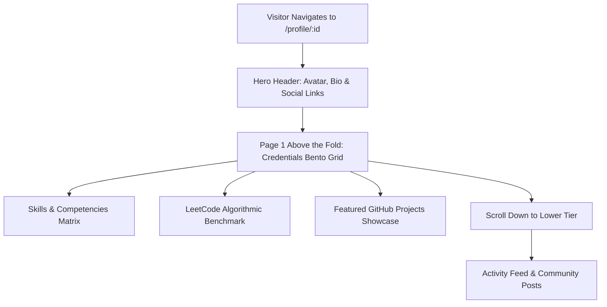
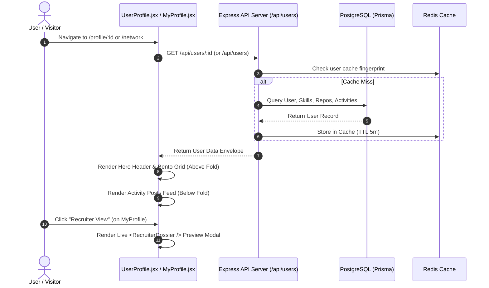

# 👤 User Profile & Network Discovery Enhancements Specification

> **Document Location**: `docs/Features_and_improvements/User_Profile_and_Network_Enhancements.md`  
> **Status**: Implemented & Verified in Production Build  
> **Last Updated**: September 1, 2026  

---

## 📌 Executive Summary

The User Profile and Peer Network system represents the core professional identity, proof-of-work showcase, and candidate discovery engine for SkillSphere. This document covers the comprehensive architectural refactor of the **Public User Profile ([UserProfile.jsx](file:///C:/Users/kshit/cs/skillsphere/client/src/features/profile/UserProfile.jsx))**, **Personal Profile Editor ([MyProfile.jsx](file:///C:/Users/kshit/cs/skillsphere/client/src/features/profile/MyProfile.jsx))**, and **Peer Network Directory ([Network.jsx](file:///C:/Users/kshit/cs/skillsphere/client/src/features/network/Network.jsx))**. The overhaul establishes a unified dark-mode theme, restructures the candidate credentials bento grid above the fold, optimizes mobile responsiveness, embeds real-time completeness tracking, and integrates live Recruiter View previews.

---

## 💡 Part 1: Non-Technical Explanation & Conceptual Data Flow

### 1.1 Simple Analogy (Resume Header vs. Feed of Tweets)

Think of visiting a candidate's portfolio like reading a high-end physical resume:
* **The Old Cluttered Flow**: The top of the page showed the candidate's name, but immediately below was a giant wall of every social message or comment they had ever posted. To see their actual technical skills, coding benchmarks, or GitHub projects, you had to scroll past pages of social chat.
* **The New Above-the-Fold Layout**: The top half of the page is an executive summary of credentials—Name, Verified Skills Matrix, LeetCode DSA benchmark score, and Featured GitHub projects. If you want to see what they recently posted, you scroll down to the bottom "Activity & Posts" section.

---

### 1.2 Plain-English 4-Step User Journey

1. **Visit Profile**: Navigating to `/profile/:id` loads the candidate's compact hero card and social links.
2. **Instant Verification Review**: Before scrolling, the visitor immediately sees the candidate's verified skills, algorithmic score (DSA), and curated repositories.
3. **Scroll for Social Updates**: The community feed (posts, discussions, image attachments) is neatly situated in the lower tier.
4. **Recruiter View & Self-Testing**: On their own profile page, users can click `👁️ Recruiter View` to preview exactly how recruiters perceive their profile.

---

### 1.3 High-Level Mermaid Flowchart



---

## ⚙️ Part 2: Technical Deep Dive & System Architecture

### 2.1 Component & Layout Architecture

```
client/src/features/profile/
├── UserProfile.jsx           # Public candidate portfolio (Hero + Above-the-fold Credentials + Lower Posts)
├── MyProfile.jsx             # Personal profile editor + Real-time Completeness Bar + Recruiter View Preview Modal
├── LeetCodeCard.jsx          # Algorithmic benchmark stats card
└── components/
    └── RecruiterDossier.jsx  # Executive hiring-manager view
```

#### Above-the-Fold Bento Grid Structure in `UserProfile.jsx`:
```jsx
<div className="space-y-6">
  {/* 1. Compact Hero Profile Card */}
  <HeroCard avatar={user.avatar} name={user.name} headline={user.headline} links={...} />

  {/* 2. Core Credentials Bento Grid (Above The Fold) */}
  <div className="grid grid-cols-1 lg:grid-cols-12 gap-6 items-start">
    <div className="lg:col-span-6 space-y-6">
      <AboutCard bio={user.bio} />
      <SkillsMatrixCard skills={user.skills} />
    </div>
    <div className="lg:col-span-6 space-y-6">
      <LeetCodeCard leetcode={user} isOwner={isOwner} />
    </div>
    <div className="lg:col-span-12">
      <GitHubProjectsSummary userId={id} userName={user.name} isOwner={isOwner} />
    </div>
  </div>

  {/* 3. Social Activity & Community Posts (Below The Fold) */}
  <div className="pt-8 border-t border-outline-var/25 space-y-6">
    <ActivityFeed posts={posts} isOwner={isOwner} />
  </div>
</div>
```

---

### 2.2 Technical Sequence Diagram



---

## 🛠️ Part 3: Diagnostics, Root Cause Analysis & Resolved Issues

### 3.1 Issue 1: Theme Disconnect on Public User Profile (`UserProfile.jsx`)

#### **What was happening?**
The public user profile displayed older cyan glowing rings (`outline-cyan-500`), inconsistent borders, and dated contrast styling compared to the dark-mode aesthetic of the Dashboard and Verifier.

#### **Why did it happen?**
`UserProfile.jsx` was developed in an earlier phase and lacked the unified design tokens (`bg-surface`, `border-outline-var/30`, `font-syne`, amber `#f59e0b` accents, and emerald verified badges).

#### **Where was it located?**
* [client/src/features/profile/UserProfile.jsx:L478](file:///C:/Users/kshit/cs/skillsphere/client/src/features/profile/UserProfile.jsx#L478)

#### **How was it resolved?**
Standardized all card containers, badges, social buttons, and avatar borders to use the unified design tokens.

---

### 3.2 Issue 2: Vertical Clutter & Hidden Credentials on Desktop & Mobile

#### **What was happening?**
The original desktop layout placed LeetCode and GitHub Project cards in a narrow left column below avatar, college, and social buttons, while the right column was filled by social posts. Consequently, critical credentials were pushed far down off-screen.

#### **Why did it happen?**
A rigid 2-column sidebar layout was used where the left column stacked 5 vertical widgets.

#### **Where was it located?**
* [client/src/features/profile/UserProfile.jsx:L474-L685](file:///C:/Users/kshit/cs/skillsphere/client/src/features/profile/UserProfile.jsx#L474-L685)

#### **How was it resolved?**
1. Re-architected into a **2-Tier Flow**:
   - **Tier 1 (Above the Fold)**: Compact Hero card + 2-column Bento Grid (About, Verified Skills Matrix, LeetCode Benchmark, GitHub Projects Showcase).
   - **Tier 2 (Below the Fold)**: Separated by a clear section divider for Community Posts and Activity.
2. **Mobile Optimization**: On mobile devices (`< lg`), cards stack in logical priority order (Hero $\rightarrow$ About $\rightarrow$ Skills $\rightarrow$ LeetCode $\rightarrow$ Projects $\rightarrow$ Posts).

---

### 3.3 Issue 3: Profile Completeness Bar Placement on Edit Profile

#### **What was happening?**
Users filling in their initial profile details (Name, Headline, Bio, College) could not see their profile strength percentage bar in the first step.

#### **Why did it happen?**
`<CompletenessBar />` was rendered in a side widget rather than inside the primary `Identity & Bio` form context.

#### **Where was it located?**
* [client/src/features/profile/MyProfile.jsx:L406](file:///C:/Users/kshit/cs/skillsphere/client/src/features/profile/MyProfile.jsx#L406)

#### **How was it resolved?**
Moved `<CompletenessBar score={completeness.score} checks={completeness.checks} />` directly to the top of `renderIdentitySection()` in `MyProfile.jsx`.

---

### 3.4 Issue 4: Missing Recruiter View Preview on `MyProfile.jsx` & Self-Exclusion in Network

#### **What was happening?**
1. Users had no way to preview how recruiters see their profile (`RecruiterDossier`) while editing `MyProfile.jsx`.
2. Users could never see their own card or ranking on the Peer Network directory (`/network`).

#### **Why did it happen?**
1. `MyProfile.jsx` lacked a preview trigger button.
2. `server/routes/users.js:L67` hardcoded `where: { id: { not: currentUserId } }`.

#### **Where was it located?**
* [client/src/features/profile/MyProfile.jsx:L755-L775](file:///C:/Users/kshit/cs/skillsphere/client/src/features/profile/MyProfile.jsx#L755-L775)
* [client/src/features/network/Network.jsx:L375-L465](file:///C:/Users/kshit/cs/skillsphere/client/src/features/network/Network.jsx#L375-L465)
* [server/routes/users.js:L66-L69](file:///C:/Users/kshit/cs/skillsphere/server/routes/users.js#L66-L69)

#### **How was it resolved?**
1. **Header Recruiter View Button**: Added a dedicated `👁️ Recruiter View` button beside `Save Changes` in `MyProfile.jsx`, opening a live modal preview of `<RecruiterDossier />`.
2. **Network Self-Inclusion**: Updated `server/routes/users.js` to only exclude self if `excludeSelf=true`.
3. **Self-Card Recognition**: Added a `(You)` badge on `Network.jsx` with a `Your Profile (View / Edit)` CTA button.

---

## 📊 Summary of Modified Files

| File Path | Changes Made |
| :--- | :--- |
| `client/src/features/profile/UserProfile.jsx` | Restructured layout: Compact Hero card + Above-the-fold Credentials Bento Grid + Lower Activity feed; applied dark theme tokens. |
| `client/src/features/profile/MyProfile.jsx` | Moved `CompletenessBar` to top of Identity step; added `Recruiter View` header button with live preview modal. |
| `client/src/features/network/Network.jsx` | Added `(You)` badge for current user card and full-width profile edit button. |
| `server/routes/users.js` | Updated `GET /api/users` query filter to allow user self-discovery in network directory. |
| `docs/Features_and_improvements/User_Profile_and_Network_Enhancements.md` | Created comprehensive feature & architecture documentation (This file). |
