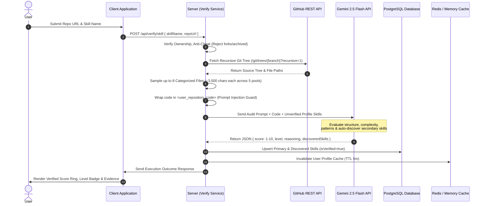
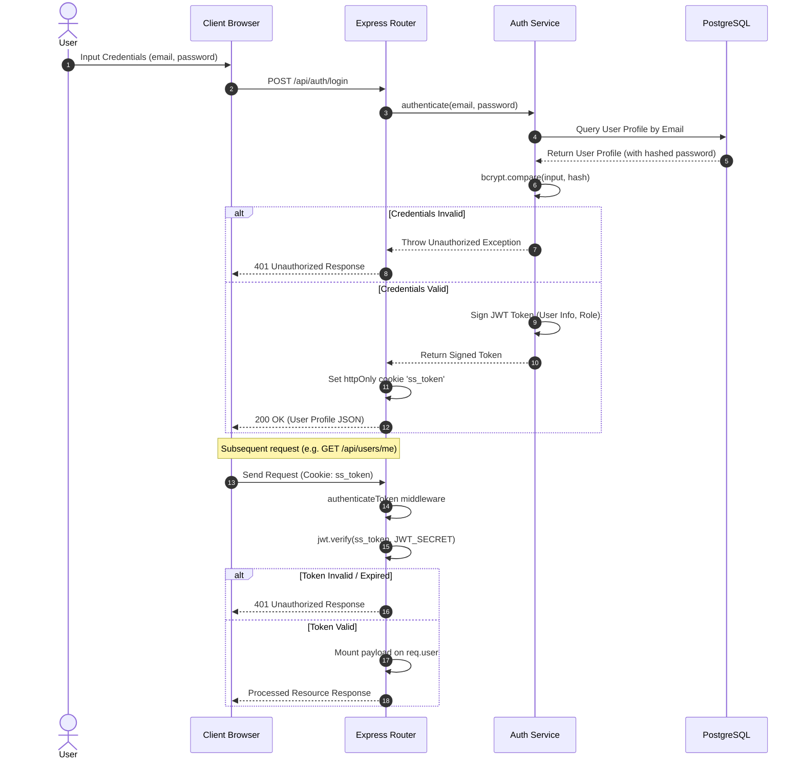
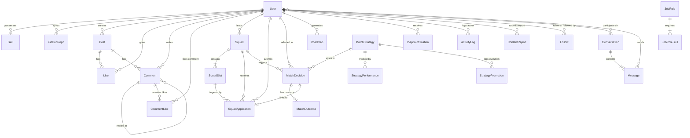
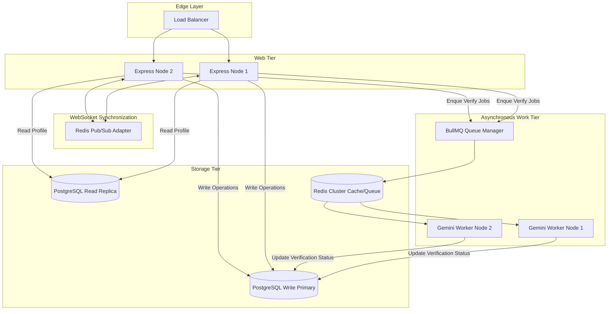

# SkillSphere — System Design Specification

This document provides the formal system design specification for SkillSphere, a peer-to-peer networking, mentoring, and squad-building platform. It describes the component models, architectural layouts, and data flows that govern the platform.

---

## 1. System Overview

SkillSphere addresses the friction in student-alumni networking and peer collaboration by anchoring user profiles to verifiable proof-of-work. The system enables:
* **Verified Skill Profiles**: Technical competencies are scored and validated via automated analysis of public GitHub repositories, rather than self-reported claims.
* **Intelligent Team Assembly (N.E.X.U.S.)**: Squad leaders recruit collaborators for target roles using a multi-strategy consensus engine.
* **AI-Guided Career Paths**: Custom structured learning roadmaps are dynamically built using current skill scoring.
* **Real-Time Communication**: Multi-channel interactions occur over instant messages, global feeds, and push notifications.

---

## 2. High-Level Architecture

SkillSphere utilizes a decoupled client-server architecture designed for high availability, separation of concerns, and ease of deployment.

```mermaid
graph TB
    subgraph Client ["Client Tier (React 19 SPA — Vite + FSD)"]
        direction TB
        UI["User Interface (13 Feature Slices)"]
        WS_C["Socket.io Client"]
        HTTP_C["Axios Client (withCredentials)"]
    end

    subgraph API ["Server Tier (Node.js 22 & Express)"]
        direction TB
        GATE["API Gateway & 15 Route Modules"]
        WS_S["Socket.io Server (User Rooms)"]
        CRON["node-cron (4 Active Jobs)"]
        
        subgraph SVC ["Service Layer"]
            AUTH_S["Auth Service"]
            NEXUS_S["N.E.X.U.S. Engine"]
            VERIFY_S["Verification Service"]
            LEET_S["LeetCode Service"]
            PORT_S["Portfolio Service"]
            AI_S["AI Service"]
            SQUAD_S["Squad Service"]
            SEARCH_S["Search Service"]
            FEEDBACK_S["Feedback Service"]
        end
    end

    subgraph DATA ["Storage Tier"]
        DB[(PostgreSQL 16 Database — 28 Models)]
        CACHE[(Redis / Memory Cache)]
    end

    subgraph EXT ["External Services"]
        GH["GitHub REST API"]
        GEMINI["Gemini 2.5 Flash API"]
        LEET["LeetCode GraphQL API"]
        SMTP["Resend / SMTP Email"]
    end

    %% Client communication
    UI --> HTTP_C
    UI --> WS_C
    HTTP_C <-->|HTTPS REST + Cookies| GATE
    WS_C <-->|WSS Bidirectional| WS_S

    %% Internal routing
    GATE --> SVC
    WS_S --> SVC
    CRON -->|Scheduled Maintenance & Evolution| DB
    CRON --> CACHE

    %% Service dependencies
    SVC <-->|Prisma ORM| DB
    SVC <-->|Get/Set Cache (TTL 5m)| CACHE
    
    %% External integrations
    VERIFY_S -->|Fetch Repos & Git Trees| GH
    VERIFY_S -->|AST Code Audit| GEMINI
    LEET_S -->|DSA Submission Stats| LEET
    PORT_S -->|Sync & Showcase| GH
    AI_S -->|Career Roadmaps| GEMINI
    AUTH_S -->|Dispatch OTP| SMTP
```

---

## 3. Components

### 3.1 Authentication & Session Service
* **Responsibility**: Processes credentials, manages JWT token signatures, hashes passwords using `bcryptjs`, and handles OTP dispatching.
* **Session Strategy**: Stateless JWT session payload set directly on client requests via HTTP-Only, secure cookies.

### 3.2 N.E.X.U.S. Match Engine
* **Responsibility**: Orchestrates matching operations. Loads squad requirements, triggers dynamic scoring strategies (e.g. GitHub skill strength, college proximity, system activity) in parallel, and checks for consensus.
* **Consensus/Exploration Policy**: If strategies agree, the consensus candidate is recommended. If they disagree, it falls back to a weighted-random selection to maintain discovery diversity.

### 3.3 Skill Verification Engine
* **Responsibility**: Validates candidate capabilities. Performs GitHub project parsing, fetches source code trees, and forwards top files to the generative AI classifier for evaluation.

### 3.4 AI Roadmap Service
* **Responsibility**: Maps current verified skills against desired roles to construct structured learning markdown templates.

### 3.5 Real-Time Communication Hub
* **Responsibility**: Maintains active WebSocket connections for direct messages, feed activity hooks, and notification pushes.

---

## 4. Data Flow

### 4.1 Skill Verification Sequence
The diagram below details the sequence from a user submitting a GitHub URL to retrieving their AI-verified skill score.



---

## 5. Authentication Flow

SkillSphere enforces stateless JWT sessions using HTTP-Only cookies. The login and token validation sequences are structured as follows:



---

## 6. Database Interaction

SkillSphere accesses PostgreSQL via the Prisma Client. 

### 6.1 Data Model Diagram


### 6.2 Key Operational Interactions
* **Daily Cleaning Cron**: A background process runs daily to identify and delete unverified `GUEST` or `STUDENT` profiles lacking a connected GitHub link.
* **Cached Reads**: User profiles and verified skills are cached inside an in-memory/Redis engine using a `300s` TTL. Updates to profiles immediately invalidate the cache.

---

## 7. External Services

* **GitHub REST API**: Used to inspect repository branches, verify code ownership, and fetch raw file streams.
* **Google Generative AI (Gemini 2.5 Flash)**:
  * Analyzes source code files for verification to generate a score (1–10) and qualitative review.
  * Formulates structured, milestone-based roadmaps containing analagous comparisons to existing skills.
* **Nodemailer SMTP Integration**: Dispatches OTPs to user mailboxes.

---

## 8. Scalability Considerations

* **Decoupling Heavy Computations (Message Queue)**: Move code verification and roadmap generation out of the HTTP cycle and into a background worker queue (e.g., BullMQ + Redis).
* **WebSocket Message Syncing (Redis Adapter)**: Implement the Socket.io Redis Adapter to propagate messages across multiple backend instances behind a load balancer.
* **Process Separation**: Partition the application deployment into an HTTP/WS Router node, a Cron Runner node, and a Background Queue Worker node.

---

## 9. Security Considerations

* **Stateless Token Protection**: Session cookies utilize the `HttpOnly` and `Secure` attributes, coupled with `SameSite=None` (where cross-origin is required) to prevent script-based exfiltration.
* **Zod Schema Enforcement**: Input validation is enforced at the entry routers to sanitize database queries.
* **Endpoint Protection & Rate Limits**: Rate-limit stores block denial-of-service attempts, specifically on AI roadmap generation, code verification, and authentication routes.

---

## 10. Future Architecture

To support growing traffic, the system should transition to the target state below:


* **Database Scaling**: Implement read/write replicas to offload read operations from the primary transactional database node.
* **Queue-Driven Verification**: Users receive a job ID (`202 Accepted`) on verification requests, poll or wait for WebSockets to return updates, and let workers process tasks at a controlled ingestion rate.
