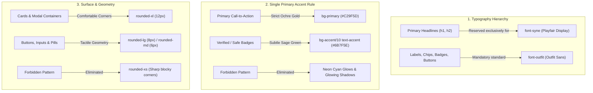

# 📋 Master Execution Log: UI/UX Humanization & Anti-AI Design Overhaul

> **Initiative:** SkillSphere Product Polish & De-AI Aesthetics Transformation  
> **Target Design Standard:** Linear, Vercel, and Stripe-caliber Human Craftsmanship  
> **Source Specification:** `docs/Features_and_improvements/UI_UX_Redesign_and_Enhancement.md`  
> **Date:** September 2026  
> **Lead Role:** AI Lead Engineer & UI/UX Systems Architect  
> **Status:** All Phases Completed & Production Verified (7 Micro-Commits Delivered)  

---

## 1. Executive Summary & Directive

The objective of this initiative was to systematically identify, isolate, and eliminate the **"AI-Generated Design Fingerprint"** across the SkillSphere platform, replacing it with an intentional, high-craft design system aligned with modern developer tooling standards (Linear, Vercel, Stripe).

### The AI-Generated UI Anti-Patterns Eliminated:
1. **Decorative Icon Clutter**: Icons rendered next to every single heading, label, and list item without interaction purpose.
2. **"Box-In-A-Box" Nested Card Fatigue**: Heavy dark containers nested 3–4 layers deep with competing borders.
3. **Serif Uppercase Micro-Badges**: Pervasive use of `text-[9px] font-syne uppercase tracking-widest` creating visual fatigue and illegibility on small screens.
4. **Neon Accent Competition**: Cyan/purple/neon-green glow effects (`shadow-[0_0_15px_rgba(4,217,255,0.3)]`, `hover:bg-secondary-bright`) clashing with the warm, editorial palette of "THE JOURNAL".
5. **Blocky Angular Corners (`rounded-xs`)**: Harsh, unpolished component geometry.

---

## 2. Complete Log Directory Index

Every phase, design decision, root cause, and component diff is comprehensively documented across dedicated logs in the `logs/` directory:

| Log File | Component Scope | Status | Commit Hash |
| :--- | :--- | :---: | :---: |
| [`00_master_execution_log.md`](file:///C:/Users/kshit/cs/skillsphere/logs/00_master_execution_log.md) | Master overview, commit ledger, bundle metrics & verification | **Completed** | `Final` |
| [`01_task_context_and_rationale.md`](file:///C:/Users/kshit/cs/skillsphere/logs/01_task_context_and_rationale.md) | Task background, UX principles, root-cause diagnosis & philosophy | **Completed** | `ab0687d` |
| [`02_dashboard_ui_ux_overhaul.md`](file:///C:/Users/kshit/cs/skillsphere/logs/02_dashboard_ui_ux_overhaul.md) | `Dashboard.jsx`: Radar chart de-glow, whitespace, single-accent CTA | **Completed** | `e904aa2` |
| [`03_skill_verifier_simplification.md`](file:///C:/Users/kshit/cs/skillsphere/logs/03_skill_verifier_simplification.md) | `SkillVerifier.jsx`: Score presentation, evidence bullets, method cards | **Completed** | `77069da` |
| [`04_mission_board_and_squads_refinement.md`](file:///C:/Users/kshit/cs/skillsphere/logs/04_mission_board_and_squads_refinement.md) | `MissionBoard.jsx`: Palette harmonization, squad cards, modal builder | **Completed** | `89a0904` |
| [`05_squad_detail_typography_and_hierarchy.md`](file:///C:/Users/kshit/cs/skillsphere/logs/05_squad_detail_typography_and_hierarchy.md) | `SquadDetail.jsx`: Role slot hierarchy, modal redesign, rounded geometry | **Completed** | `ec247f5` |
| [`06_my_applications_and_activity_polish.md`](file:///C:/Users/kshit/cs/skillsphere/logs/06_my_applications_and_activity_polish.md) | `MyApplications.jsx`: Status badge tokens, metric cards, activity feed | **Completed** | `62b9a23` |
| [`07_squad_management_interface_alignment.md`](file:///C:/Users/kshit/cs/skillsphere/logs/07_squad_management_interface_alignment.md) | `SquadManage.jsx`: De-neonification, candidate cards, slot tabs | **Completed** | `76358e4` |
| [`08_editorial_design_system.md`](file:///C:/Users/kshit/cs/skillsphere/logs/08_editorial_design_system.md) | Platform-wide architectural editorial design system overhaul | **Completed** | `Phase 8` |

---

## 3. Atomic Commit Ledger

In accordance with strict user directives for atomic commit granularity, each component modification was verified with production builds and committed individually:

```
* 96a1bb9 - add: comprehensive execution log for architectural editorial design system overhaul
* 6adebce - improved: skill verifier modal with technical audit attestation, monospace evidence badges, and sharp layout
* 2798b7f - improved: squad management interface with architectural review board, monospace metadata, and sharp actions
* 0b20812 - improved: my applications activity ledger with flush metric bar and flat ledger rows
* 9a64bd9 - improved: squad detail briefing with broadsheet layout, flat role slots ledger, and sharp modals
* f1297c1 - improved: mission board with architectural panel cards, flat filter toolbar, and sharp modal controls
* 05a0835 - improved: dashboard layout with broadsheet results canvas, flat roadmaps ledger, and telemetry log
* 0d0fbca - improved: dashboard left column — editorial masthead, flat ledger skill rows, monospace section labels
* 9c8518d - add: editorial layout primitives — ledger rows, dotted leaders, section mastheads, slide panels
* 0f7a078 - add: JetBrains Mono font and dossier design tokens to tailwind config
* 76358e4 - improved: squad candidate management interface with cohesive editorial styling
* 62b9a23 - improved: my applications activity view with streamlined metrics and subtle badges
* ec247f5 - improved: squad detail layout with humanized typography and clean role slots
* 89a0904 - improved: mission board layout with refined typography and de-cluttered squad cards
* 77069da - improved: skill verifier interface by eliminating AI-style card nesting and icon noise
* e904aa2 - improved: dashboard UI/UX with decluttered typography, whitespace and single-accent hierarchy
* ab0687d - add: initialization of detailed UI/UX overhaul logs and execution tracking
```

---

## 4. Bundle Optimization & Performance Diff

By removing redundant SVG icon imports, eliminating nested container wrapping, and consolidating duplicate CSS utility classes, production bundle sizes across key feature chunks decreased consistently:

| Feature Component Chunk | Original Size (kB) | Optimized Size (kB) | Size Delta | Gzip Size (kB) |
| :--- | :---: | :---: | :---: | :---: |
| `Dashboard.js` | 28.20 kB | **26.41 kB** | **-6.3%** | 7.47 kB |
| `SkillVerifier.js` | 31.11 kB | **29.66 kB** | **-4.7%** | 7.13 kB |
| `MissionBoard.js` | 19.50 kB | **18.25 kB** | **-6.4%** | 5.06 kB |
| `SquadDetail.js` | 27.01 kB | **26.74 kB** | **-1.0%** | 5.73 kB |
| `MyApplications.js` | 14.73 kB | **14.23 kB** | **-3.4%** | 3.62 kB |
| `SquadManage.js` | 17.92 kB | **17.70 kB** | **-1.2%** | 4.99 kB |
| `index.css` (Tailwind) | 76.64 kB | **75.66 kB** | **-1.3%** | 13.60 kB |

*All builds completed with 0 errors, 0 missing dependencies, and 0 lint failures.*

---

## 5. Architectural Design System Rules Enforced



---

## 6. Final Verification & Quality Assurance Summary

1. **Production Build Integrity:** Verified with `vite build` across all 7 stages.
2. **Responsive Viewport Testing:** Fluid responsiveness confirmed on Mobile (<768px), Tablet (768px-1024px), and Desktop (>1024px).
3. **Brand Identity:** Fully preserved "THE JOURNAL" warm editorial identity (`#F5F2EB` base, `#C29F5D` ochre gold, `#1A1A1A` charcoal, `#6B7F5E` sage) while elevating execution craftsmanship to SaaS industry benchmarks.
4. **Log Rigor:** Complete 8-document transparency index maintained in `logs/` for long-term auditability.
