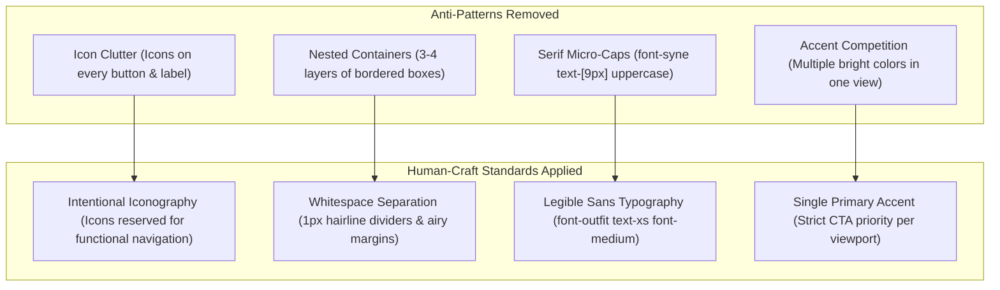

# 📋 Master Execution Log: UI/UX Humanization & Anti-AI Design Overhaul

> **Initiative:** SkillSphere Product Polish & De-AI Aesthetics Transformation  
> **Target Design Standard:** Linear, Vercel, and Stripe-caliber Human Craftsmanship  
> **Source Specification:** `docs/Features_and_improvements/UI_UX_Redesign_and_Enhancement.md`  
> **Date:** September 2026  
> **Author/Owner:** AI Lead Engineer & UI/UX Systems Architect  

---

## 1. Executive Summary & Directive

The objective of this initiative is to eliminate the distinct **"AI-Generated Design Fingerprint"** from the SkillSphere platform and elevate its visual language and user experience to production-grade SaaS standards. 

Early iterations of generative UI tools (e.g., v0, Tailwind AI prompts) default to a recognizable visual vocabulary:
* Dense, decorative icon scattering next to every word and button.
* Deeply nested card containers ("box-in-a-box syndrome") with heavy dark borders.
* Overuse of micro-scale uppercase text badges rendered in serif fonts (`text-[9px] font-syne uppercase tracking-widest`).
* High visual cognitive load caused by competing accents and dark glassmorphic glows.

This master log tracks the systematic overhaul across the codebase, ensuring every modification is committed incrementally with clear, descriptive commit messages adhering to the project format (`add: ...`, `improved: ...`).

---

## 2. Log Directory Index

To provide complete visibility and architectural rigor, the logs are modularized into dedicated Markdown files inside `logs/`:

| Log File | Topic & Scope | Status |
| :--- | :--- | :---: |
| [`00_master_execution_log.md`](file:///C:/Users/kshit/cs/skillsphere/logs/00_master_execution_log.md) | Master overview, execution roadmap, and commit ledger | **In Progress** |
| [`01_task_context_and_rationale.md`](file:///C:/Users/kshit/cs/skillsphere/logs/01_task_context_and_rationale.md) | Task breakdown, UX principles, root-cause diagnosis, and design system philosophy | **Ready** |
| [`02_dashboard_ui_ux_overhaul.md`](file:///C:/Users/kshit/cs/skillsphere/logs/02_dashboard_ui_ux_overhaul.md) | De-cluttering `Dashboard.jsx`, typography refinement, and single-accent CTA rule | **Pending** |
| [`03_skill_verifier_simplification.md`](file:///C:/Users/kshit/cs/skillsphere/logs/03_skill_verifier_simplification.md) | Redesigning `SkillVerifier.jsx`, method selection flow, and score representation | **Pending** |
| [`04_mission_board_and_squads_refinement.md`](file:///C:/Users/kshit/cs/skillsphere/logs/04_mission_board_and_squads_refinement.md) | Restructuring `MissionBoard.jsx`, role slot cards, and badge palette harmony | **Pending** |
| [`05_typography_and_design_system_alignment.md`](file:///C:/Users/kshit/cs/skillsphere/logs/05_typography_and_design_system_alignment.md) | Global typography token alignment, form label clarity, and component consistency | **Pending** |

---

## 3. High-Craft Human Design Principles Applied

---

## 4. Execution Roadmap & Commit Tracker

| Phase | Target Scope | Key Files Modified | Target Commit Message |
| :---: | :--- | :--- | :--- |
| **Phase 1** | Comprehensive log framework creation | `logs/*.md` | `add: initialization of detailed UI/UX overhaul logs and execution tracking` |
| **Phase 2** | Dashboard UI/UX humanization | `client/src/pages/Dashboard.jsx` | `improved: dashboard UI/UX with decluttered typography, whitespace and single-accent hierarchy` |
| **Phase 3** | Skill Verifier interface simplification | `client/src/features/skills/SkillVerifier.jsx` | `improved: skill verifier interface by eliminating AI-style card nesting and icon noise` |
| **Phase 4** | Mission Board & squad cards refinement | `client/src/features/squads/MissionBoard.jsx` | `improved: mission board layout with refined typography and de-cluttered squad cards` |
| **Phase 5** | Typography & design system alignment | `client/src/features/squads/SquadDetail.jsx`, `client/src/features/squads/MyApplications.jsx` | `improved: typography and design system alignment across squad details and shared components` |
| **Phase 6** | Final verification and master documentation update | `logs/00_master_execution_log.md` | `add: final master execution log documenting all UI/UX humanization deliverables` |

---

## 5. Ongoing Quality & Regression Verification

- **Compilation / Build Check:** Every incremental change will be validated using `npm run build` inside `client`.
- **Responsive Layout Integrity:** Grid and flex wrappers checked for mobile (`< 768px`), tablet (`768px - 1024px`), and desktop (`> 1024px`).
- **Brand Consistency:** Preservation of the core "THE JOURNAL" warm editorial identity (`#F5F2EB` base, `#C29F5D` ochre gold, `#1A1A1A` charcoal, `#6B7F5E` sage) while elevating execution craftsmanship.
